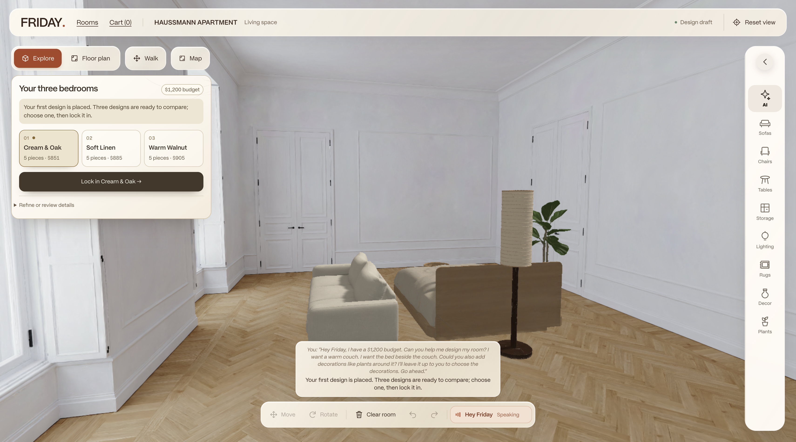
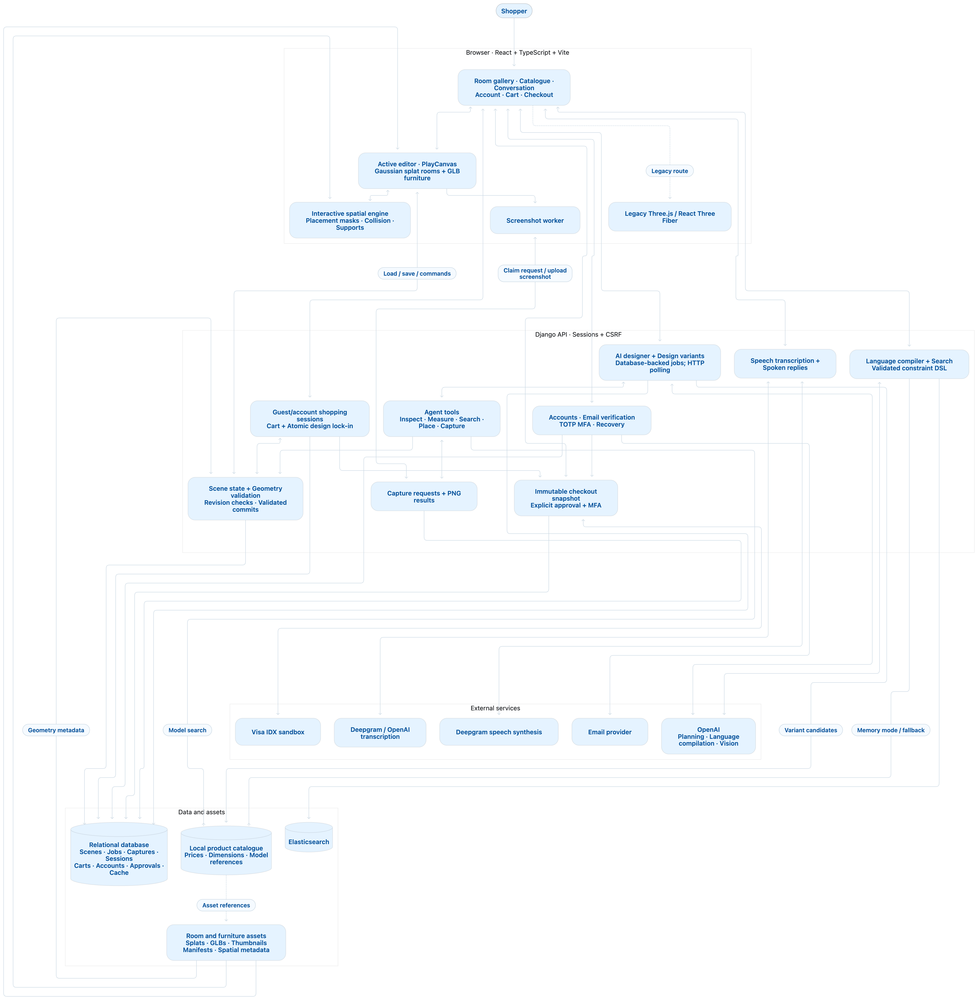

# FRIDAY

**Furnish Rooms Intelligently. Design Around You.**

🏆 **3rd place · OpenAI’s “5th Teammate” Challenge · HackMIT 2026 at MIT**

FRIDAY is a spatial analysis engine and agent harness for furnishing rooms with AI. Describe the space you want, compare designs in 3D, and ask GPT to find furniture, check how it fits, and adjust the arrangement.



*Three bedroom designs in the Haussmann apartment, ready to compare and refine.*

## Why we built it

Furnishing a space means keeping track of layouts, measurements, budgets, and product listings at the same time. A piece can look right on its own and still block a doorway or leave too little room beside a bed. Those decisions multiply across an entire floor or building.

FRIDAY brings product search and spatial reasoning into the room. The agent works with object dimensions, placement tools, and rendered views, so you can spend more time deciding how the space should look and feel.

## Design a room with FRIDAY

> “Hey Friday, I have a $1,200 budget. Can you help me design my room?”

1. **Explore the room.** Walk through a prepared 3D environment or switch to a floor-plan view.
2. **Describe what you want.** Give FRIDAY a design brief through text or voice.
3. **Compare designs.** The bedroom workflow produces three five-piece arrangements within its $1,200 demo budget. Preview each one in the room.
4. **Refine your choice.** Ask for a brown sofa or move a lamp beside it. Changes apply to the selected draft, leaving the alternatives available.
5. **Review the furniture.** Lock in a design and review its cart. Visa sandbox checkout requires explicit approval and account MFA.

The gallery includes the Haussmann apartment, a light-filled studio, and the London skyscraper. Rooms combine Gaussian splats or meshes with editable GLB furniture; available entries depend on packaged or downloadable assets.

## Give the agent spatial context

The **OpenAI Agents SDK** connects GPT to a set of scene and catalogue tools:

| Capability | What the agent can do |
| --- | --- |
| Scene inspection | Read object identities, dimensions, positions, and the current selection |
| Product discovery | Search the furniture catalogue for items with usable 3D models |
| Spatial analysis | Measure clearances and place objects relative to existing furniture |
| Placement validation | Check supported placements against geometry before committing changes |
| Visual feedback | Request screenshots from the open editor, tied to the scene revision |
| Design refinement | Stage edits, revise the selected draft, and save accepted arrangements |

Natural-language search requests are compiled into a structured constraint language (DSL). Elasticsearch applies text queries and deterministic filters for supported requirements such as price, material, and dimensions. The designer also searches a local model catalogue when choosing furniture for scene edits.

## How it works



[Open the architecture diagram at full resolution](docs/assets/friday-architecture.png)

The browser renders the room, handles interactive placement, and supplies screenshots to the agent. Django manages saved scenes, revisions, design jobs, accounts, carts, and checkout records. The active renderer is **PlayCanvas**; the earlier **Three.js / React Three Fiber** editor remains accessible through `/?legacy`.

| Layer | Technology |
| --- | --- |
| Interface | React 19, TypeScript, Vite |
| 3D scene | PlayCanvas, Gaussian splats, GLB furniture |
| API and persistence | Django, Django REST Framework, SQLite locally; PostgreSQL configuration for deployment |
| AI design | OpenAI Agents SDK with application-defined scene and catalogue tools |
| Product discovery | Elasticsearch with a local in-memory catalogue fallback |
| Speech | Browser speech recognition or server-side OpenAI / Deepgram transcription; Deepgram spoken replies |
| Identity and checkout | django-allauth, authenticator MFA, Visa IDX sandbox |

See the [system architecture](docs/architecture/system.md) for the full data flow and the [scene designer guide](docs/backend/scene-designer/README.md) for agent tools and scene validation.

## Local setup

Requires **macOS, Linux, or WSL**, **Node.js 22.12+ with npm**, and internet access for initial installation and any downloaded room assets.

From the repository root:

```bash
./setup.sh
./run-local.sh
```

`setup.sh` installs uv if needed, creates `.env` from `.env.example` if absent, syncs the Python environment, installs frontend dependencies, runs migrations, and initializes the database cache and local MFA encryption key. uv can provision Python. Existing `.env` and database data are preserved.

Open **http://127.0.0.1:5173**, enter the gallery, and choose an available room. The API health endpoint is **http://127.0.0.1:8000/api/health/** and the Django admin is at **http://127.0.0.1:8000/admin/**.

Both servers reload during development; **Ctrl-C stops both**. To use different ports:

```bash
BACKEND_PORT=8211 FRONTEND_PORT=5211 ./run-local.sh
```

Shell variables override `.env`. The launcher reports occupied ports instead of replacing an existing server. Docker is not required for this local workflow.

### Configuration

Keep credentials in the private root `.env`; use [.env.example](.env.example) as the configuration reference. Restart the relevant server after changing settings.

| Capability | Configuration |
| --- | --- |
| Local catalogue browsing | `SEARCH_BACKEND=memory` (default); no Elasticsearch credentials needed |
| AI design and language interpretation | `OPENAI_API_KEY` |
| Elasticsearch search | `SEARCH_BACKEND=elastic`, `ELASTIC_URL`, `ELASTIC_API_KEY`, and a populated catalogue index |
| Speech input | `STT_PROVIDER=browser`, `openai`, or `deepgram`; server providers require their corresponding API key. `TRANSCRIBE_BACKEND` is a compatibility fallback. |
| Spoken replies | `DEEPGRAM_API_KEY` |
| Local account verification | Development-only private inbox via `AUTH_LOCAL_INBOX_ENABLED`; configure SMTP for real email |
| Visa sandbox | Private credential configuration described in the [sandbox guide](docs/visa-sandbox.md) |

You can explore available rooms and manually arrange catalogue furniture without AI or payment credentials. AI design, provider-backed speech, and sandbox submission require their respective services. The local database is `backend/db.sqlite3`; preserve its associated MFA key in `backend/.runtime/mfa.key` when keeping account data.

### Room and furniture assets

The room gallery derives its entries from `shared/public-rooms.json` and asset availability. Missing Haussmann assets can be downloaded through the gallery. Large scans and privately licensed room sources are not all bundled in a fresh clone; see the [Haussmann setup guide](docs/frontend/room-capture/haussmann-apartment.md) for preparation and known visual limits.

Room and furniture assets carry their own licenses and attribution requirements. Preserve the supplied credits when redistributing them; see the [ABO furniture asset notes](docs/frontend/3d-object/abo-asset-notes.md) for that collection.

## Checks and common commands

Run from the repository root after setup:

```bash
(cd backend && uv run python manage.py check)
(cd backend && OPENAI_API_KEY= DEEPGRAM_API_KEY= ELASTIC_URL= ELASTIC_API_KEY= COMPILE_LIVE_TEST=0 uv run python manage.py test)
(cd frontend && npm test)
(cd frontend && npm run build)
```

Run the backend suite **without app labels** so it includes every application. These checks also run in [CI](.github/workflows/ci.yml). Provider calls and physical microphone behavior need separate live verification; an offline test run does not establish either.

To create a local admin account:

```bash
(cd backend && uv run python manage.py createsuperuser)
```

Add Python dependencies with `uv add` from `backend/` and frontend dependencies with `npm install` from `frontend/`. Commit the corresponding lockfile changes when updating dependencies.

## Layout

| Path | Purpose |
| --- | --- |
| `frontend/src/App.tsx` | Entrance, gallery, room, account, cart, and checkout routing |
| `frontend/src/SplatEditor.tsx` | Active room editor and design interaction |
| `frontend/src/scene/` | Spatial tools, room state, design UI, and PlayCanvas integration |
| `frontend/src/{shopping,auth,checkout}/` | Shopping, identity, approval, and receipt UI |
| `backend/api/` | Saved scenes, geometry validation, designer jobs, and agent tools |
| `backend/catalogue/` | Product search, language constraints, and speech endpoints |
| `backend/{shopping,accounts,checkout,visa}/` | Cart persistence, identity, MFA, and sandbox transactions |
| `backend/config/` | Django settings and routing |
| `shared/` | Room manifests, spatial metadata, furniture models, and asset credits |
| `scripts/` | Local launcher, asset preparation, validation, and release utilities |
| `room_mesh/` | Standalone experimental phone-video reconstruction pipeline |
| `docs/`, `INDEX.md` | Feature guides, architecture, setup notes, and documentation index |

The development frontend proxies `/api` and `/_allauth` requests to Django. Production needs equivalent routing; Vite’s development proxy is not included in the build. The repository includes separate frontend and backend Vercel configurations; follow the [deployment guide](docs/frontend/room-cart-deployment.md) for environment settings, migrations, and paired release verification.

## Documentation

- [Documentation index](INDEX.md) — all feature guides and project notes
- [Scene designer](docs/backend/scene-designer/README.md) — agent tools, placement, and visual feedback
- [Accounts and checkout](docs/account-mfa-checkout.md) — verification, MFA, and sandbox approval
- [Deployment](docs/frontend/room-cart-deployment.md) — environment configuration and release workflow
