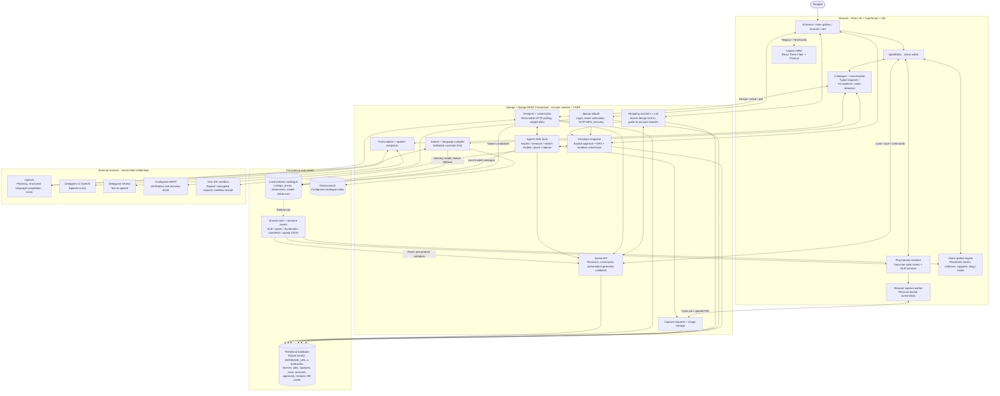
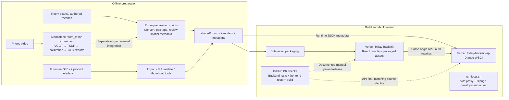

# FRIDAY system architecture

Source snapshot: 2026-09-20, current local working tree including concurrent, uncommitted work. Scoped with GPT-5.6 Luna and checked against source. This describes code structure, not a live deployment or end-to-end acceptance claim.

## Application runtime

## Asset preparation and delivery

## Boundaries that matter

- The active editor is PlayCanvas. Three.js/React Three Fiber remain behind explicit legacy/test routes and in supporting tooling.
- The browser owns rendering, interactive placement and screenshot generation. Python owns saved-scene authorization, revision checks and placement validation. Visual splats alone do not establish measured geometry: room spatial metadata and calibration determine what can be validated.
- Designer tools stage edits; the application validates and commits them. Resumable jobs live in the database and advance through HTTP polling and OpenAI background responses. This is not a Celery/Redis worker architecture.
- Browser capture jobs require an open editor. The backend does not run a hidden 3D renderer. The image-to-agent loop is capture request → browser PNG → backend → model.
- `/api/search` selects Elasticsearch or memory; Elasticsearch failures fall back to the local feed. The designer's `search_models` tool directly searches the local catalogue, so it should not be drawn as necessarily passing through Elasticsearch.
- Variant generation, wake voice and related paths are present in the working tree, including uncommitted changes. Their presence is not proof that the complete physical microphone, autonomous design or approved checkout workflow has passed live acceptance.
- Checkout uses immutable snapshots, explicit user approval and MFA. Visa IDX is a sandbox integration; it does not establish a real purchase, merchant order or settlement.
- Phone-video reconstruction is a standalone experimental pipeline, not an automatic production upload-to-room service. Floor-plan ingestion in the proposal should not be inferred as a completed runtime feature.
- Production deployment topology follows checked-in configuration and the deployment guide. The two Vercel projects require the documented paired manual release until automatic Git deployment is verified. No live deployment was inspected for this diagram.
- The local project-manager Kanban is developer tooling, not part of the shopper runtime.

## Source map

| Area | Primary source |
| --- | --- |
| Routes and active editor | `frontend/src/App.tsx`, `frontend/src/SplatEditor.tsx` |
| Renderer and interactive geometry | `frontend/src/scene/playcanvas/`, `frontend/src/scene/` |
| Browser screenshots | `frontend/src/scene/useCaptureWorker.ts`, `frontend/src/scene/playcanvas/capture.ts` |
| API routing | `backend/config/urls.py`, `backend/api/urls.py`, `backend/catalogue/urls.py` |
| Designer / vision / variants | `backend/api/designer_agent.py`, `designer_jobs.py`, `designer_variants.py`, `designer_vision.py` |
| Authoritative scene state | `backend/api/scene_service.py`, `designer_geometry.py`, `models.py` |
| Language / search / voice | `backend/catalogue/views.py`, `dsl/compile.py`, `es.py`, `memory.py`, `transcribe.py`, `speak.py` |
| Commerce and identity | `backend/shopping/`, `backend/accounts/`, `backend/checkout/`, `backend/visa/` |
| Database and cache | `backend/config/settings.py` |
| Assets / preparation | `shared/`, `scripts/gaussian_room/`, `scripts/`, `room_mesh/room_mesh/cli.py` |
| Local / production hosting | `run-local.sh`, `frontend/vite.config.ts`, `frontend/vercel.mjs`, `backend/vercel.json`, `docs/frontend/room-cart-deployment.md` |

Verification: inspected the listed routing, service, model and configuration boundaries. No application code was changed, runtime tests were required, or servers were started for this documentation task.
