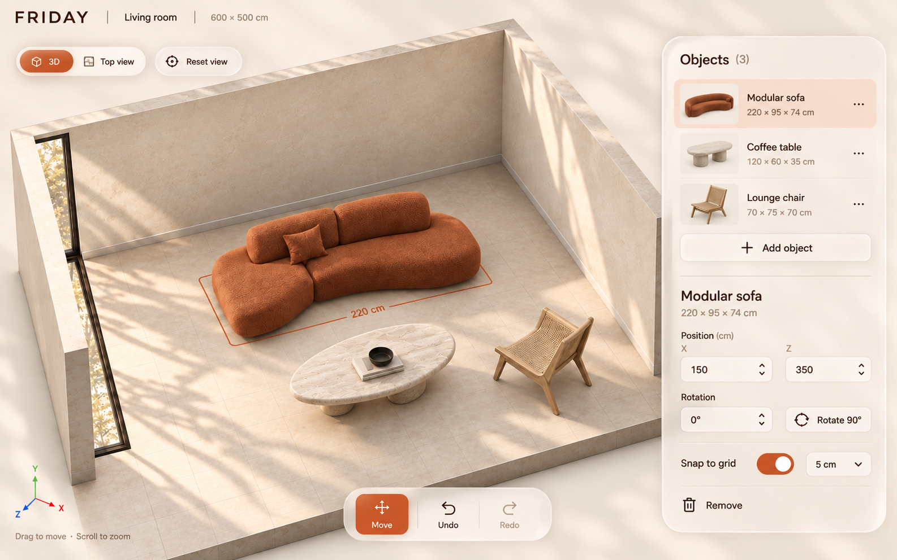

# Selected direction: Atelier glass + Noir room + Japandi materials

2026-09-19 · User-selected design direction. The combined image is an earlier composition reference, not implemented UI; the newer Mori, liquid-glass motion, and Japandi/wabi-sabi requirements below take precedence.

Latest generated still uses the user's [attached palette reference](images/atelier-user-reference.png): warm ivory, terracotta, espresso, and sand. This correction supersedes the earlier cool-blue interpretation of Atelier. Preserve the layout and liquid glass from [the preceding version](images/05-atelier-japandi-glass.png). This is a visual target, not a demonstration of animation or exact Mori rendering. Editable-looking rotation and the snap dropdown do not expand foundation controls.

## Visual decisions

- Atelier supplies the warm ivory app shell, espresso typography, terracotta active controls and selection accents, translucent liquid-glass panels, and precise compact form fields.
- Noir supplies the contained architectural box: a tangible floor slab, substantial wall thickness, open foreground, elevated oblique view, and grounded directional lighting. Keep the app shell light; do not bring Noir's charcoal panels or chartreuse accents into this combination.
- Japandi and wabi-sabi guide the room and furniture: warm limewash/plaster, quiet stone grain, natural oak or walnut, oatmeal linen, low sculptural furniture, and restrained organic asymmetry. Imperfection belongs in texture and object form; grid scale, layout alignment, and numeric controls remain precise. The result should feel like a calm contemporary design studio with advanced tools.
- Use terracotta for interface selection, focus, active view switches, and the selected footprint. The reference uses a rust/terracotta sofa, pale travertine table, and natural oak chair; future furniture retains its own asset materials.
- Use PP Mori for the wordmark and interface typography. Typography guidance and the pending font-file handoff are below.
- Preserve Noir's practical scene emphasis: a broad viewport with a single combined object-list/property sidebar. Avoid permanent full sidebars on both sides.
- Keep camera view/reset controls near the viewport top, edit/undo controls near the bottom, and centimeter fields in the selected-object inspector.
- Remove decorative slogans, promotional panels, invented badges, and nonfunctional navigation. Furniture quality and lighting provide visual character.

## Implementation priorities

At a 1366 × 768 laptop viewport, target a compact 52–60 px header and roughly 280–320 px right inspector. Give the remaining width to the 3D canvas. If inspector contents overflow, scroll that panel independently; never shrink labels or hide essential controls behind the room. Keep visible button text or accessible labels, clear selected/focus states, and comfortable click targets.

Initial palette targets: app surface #F5EEE4, glass fill warm ivory #FFF8EF with transparency, text #38251B, terracotta accent #C65A2E, warm peach selection #F5DECD, dividers #DFD0C2. These are proposed tokens inspired by the attachment, not sampled measurements. Verify text, active-control, and focus contrast during implementation; use darker terracotta where needed for readable small labels.

## Liquid-glass surfaces and motion

Use one coherent family of rounded glass surfaces for the object inspector, camera switch, and tool dock: milky translucent fill, background blur, a fine illuminated edge, subtle inset shading, and a broad soft shadow. Let the 3D room remain perceptible through panel margins, while text and controls sit on sufficiently opaque regions to remain readable over any room color. Avoid stacking several nested glass cards.

User confirmed subtle glass at rest with Apple-inspired liquid formation when panels appear: the glass expands continuously from its trigger, briefly stretches into a rounded pane, then settles while the contents fade in. Close reverses toward the trigger. Keep content unscaled in a separate layer; animate the glass silhouette and reveal mask rather than stretching text. Proposed timing targets:

| Interaction | Motion intent | Initial timing target |
| --- | --- | --- |
| Hover/press | Small lift or compression in the surface, with an edge highlight; label stays stable | 120–180 ms |
| 3D/top-view selection | Shared glass selection pill slides and gently reshapes into the next tab | 220–300 ms |
| Panel open/close | Glass grows from the trigger into a pane, with a short fluid edge stretch and settle; content fades in after its space is established | 320–420 ms |
| Object selection | Immediate footprint feedback; property contents crossfade without jumping the entire inspector | 120–180 ms |
| Camera transition | Controlled short move between views; direct manipulation interrupts it immediately | 300–450 ms |

Furniture follows the pointer immediately. Do not apply spring lag to dragging, numeric values, or solver-relevant geometry. Concentrate the liquid feel in panel boundaries, active pills, and short transitions; do not distort text, add idle waves, or animate the entire interface continuously.

Start with CSS/compositor transforms, opacity, static backdrop blur, and a consistent easing system. Reserve genuine lens-like refraction for a bounded experiment if the user wants stronger glass; ordinary blur must not be described as true refraction. Do not add a global refractive render pass before measuring the 3D scene. Honor reduced-motion with immediate changes or short fades. Test opaque fallback surfaces if blur is unavailable, and retain visible keyboard focus and legible contrast.

Glass intensity and reveal direction are confirmed. Exact spring tuning requires an interactive prototype; no motion library or implementation has been selected in this design pass.

## PP Mori typography

Use [PP Mori](https://pangrampangram.com/products/mori), as explicitly selected by the user. The foundry lists web formats including WOFF2, variable styles, and tabular figures. Prefer actual available weights: Regular 400 for body/field values, Medium 500 for controls, Semibold 600 for section labels, with tabular numerals for dimensions and positions. Avoid turning every label into small tracked uppercase text.

Working size targets at laptop scale: 14–16 px interface text, 12–13 px only for secondary captions, and 24–28 px compact brand text. Keep numeric values crisp and steady during edits. Use the real font files in implementation; a generated image cannot establish exact Mori glyph fidelity.

No Mori font files were found under frontend/ or docs/ during this pass. The user has been asked whether webfont files are available and where they are located. Do not substitute an arbitrary scraped font binary from the foundry site. If files are pending, a temporary system sans fallback can keep functional development moving, but it is not final Mori typography. Font files/usage scope must be supplied appropriately before shipping the intended font.

## Scope and open choices

Confirmed: Atelier colors and glass panels; Noir room-box composition; Mori; Japandi/wabi-sabi room/furniture styling; fluid glass motion; laptop only. No additional aesthetic direction workshop is needed.

Confirmed motion: subtle glass with fluid pane formation from its trigger. The user requested online Mori research and a design image first; the official foundry page offers a trial and lists WOFF2. Font files have not been acquired or installed. This does not block units, room geometry, loading, or editor-state implementation. Final material richness still depends on collaborator assets; preserve the [foundation plan](../3d-engine-plan.md) scope.

The fixture starts empty and furniture is added through the editor. A simple rectangular floor and cutaway walls establish the room before supplied GLBs arrive. The generated image illustrates a populated state; exact sculptural furniture, textured stone, window scenery, and soft daylight depend on asset availability and measured rendering cost. The first build can use simpler material approximations while preserving composition and interaction quality.

Follow the [foundation plan](../3d-engine-plan.md) for behavior and the [furniture handoff](../3d-object/collaborator-handoff.md) for assets. Do not infer extra functionality from the image: dimensions are read-only, rotation is initially quarter-turn buttons, snap is initially the configured one-unit spacing with an on/off toggle, and there are no resize handles or physical-validity claims. Keep one labeled Add action. Numeric labels/positions and apparent dimensions in the generated reference are illustrative, not geometric test fixtures.

## Generation record

### Warm palette correction

Generated with the built-in image tool from the preceding layout and the user-supplied palette reference. Final asset: `images/06-warm-atelier-glass.png`. Earlier prompts below are historical and do not override the current warm palette.

Warm palette generation prompt

Edit the FIRST image, the latest FRIDAY liquid-glass furniture editor. Preserve its exact layout, camera angle, contained architectural room-box geometry, thick floor slab and cutaway walls, compact header, top-left view controls, single floating right object-list/property inspector, and bottom-center small tool dock. Preserve the beautiful rounded liquid-glass contours, translucent panels, luminous fine optical rims, soft shadows, and readable controls.

The SECOND image is the user's authoritative COLOR PALETTE AND ATMOSPHERE reference only. Transfer its warm ivory, cream, sand, terracotta/burnt orange, and dark espresso palette to image one. Replace ALL cold blue/cobalt/navy UI styling with terracotta active buttons, warm peach selected rows, espresso typography, taupe secondary labels, warm ivory translucent glass, creamy background. Accent target approximately #C65A2E, text #38251B, background #F5EEE4. Maintain real neutral material color, do not simply apply a uniform orange filter. Warm natural sunlight, tactile Japandi/wabi-sabi atmosphere. Recolor the selected sculptural sofa in the FIRST image to the reference's rich terracotta rust boucle, keeping its exact geometry and placement. Coffee table becomes pale warm travertine, same geometry/placement; retain the natural oak woven chair. Warm cream plaster and stone room. Thin terracotta selection footprint, no resize handles.

CRITICAL: do not copy second image's layout: no huge FRIDAY title, no left vertical toolbar, no large bottom furniture catalog, no promotional slogans. Keep FIRST image layout and glass styling. Keep compact PP Mori-inspired refined sans-serif, same legible hierarchy. Retain Objects (3), three object rows, one Add object button, Modular sofa, 220 × 95 × 74 cm, position X150 Z350, rotation 0° and Rotate 90°, Snap to grid 5 cm, Remove. Remove duplicate plus icon in inspector header and sun/profile icons from top header. Keep 3D, Top view, Reset view and bottom Move, Undo, Redo. Final polished single landscape desktop screenshot, premium calm warm design-studio aesthetic. This is a settled still of the liquid glass UI, no literal liquid, splashes, motion trails or animation frames.

Latest image generated with the built-in image tool using the earlier combined image as reference. Saved at `images/05-atelier-japandi-glass.png`. Visually inspected; motion and exact font fidelity require implementation.

Latest generation prompt

Use case: ui-mockup. Generate ONE refined high-fidelity desktop furniture room editor screenshot, landscape 16:10, no device frame. Reference image supplies existing FRIDAY layout, Atelier cool white/navy/cobalt palette, and Noir contained box-shaped architectural 3D room. Evolve it into the user's selected JAPANDI + WABI SABI aesthetic with elegant APPLE-INSPIRED LIQUID GLASS floating panels. It must look like a beautiful usable modern spatial editing application, not a marketing page.
Composition: compact 56px header with FRIDAY at left, Living room, 600 × 500 cm. Large 3D viewport covering about 75% width and almost full height. Show entire architectural room box with tangible thick stone floor slab, two substantial cutaway plaster walls, open front; a little breathing room around the box, no cropped wall tops. Elevated oblique view. Warm ivory limewash with subtle irregular texture, pale stone floor with very fine faint grid, oatmeal sculptural low linen sofa selected with thin cobalt footprint; organic dark walnut coffee table; low sculptural oak-and-woven lounge chair. Quiet warm daylight and grounded shadows. Restrained authentic materials, calm asymmetry, refined design furniture. Minimal decor, no plant clutter, no chrome futuristic spaceship furniture.
Interface cool pale blue-white #F5F7FB, deep navy #102044 typography, cobalt #165DFF active controls. Typography visually follows PP Mori: clean refined contemporary Japanese-inspired gothic sans, regular text, medium controls, semibold titles, calm spacing; no serif. Main typography sharp readable.
KEY CHANGE: the inspector must FLOAT as a rounded translucent milky GLASS panel inset 20px from right edge, with scene softly visible behind its margins, luminous fine rim, rounded 24px corners, delicate optical depth and soft shadow. Subtle glass at rest; premium polished thick optical edge, not a flat white sidebar. Strong legibility and stable text. No nested glass cards. Single combined panel heading Objects (3), compact rows Modular sofa, Coffee table, Lounge chair with material thumbnails. One Add object button. Fine divider, selected Modular sofa, read-only 220 × 95 × 74 cm. Position (cm) fields X 150 and Z 350. Rotation 0° plus Rotate 90° button. Snap to grid enabled, 5 cm text. Remove action. No second permanent sidebar.
Top-left compact floating liquid-glass 3D / Top view pill and Reset view. Bottom-center small floating glass dock Move selected cobalt, Undo, Redo. Glass contours have smoothly stretched organic pill edges suggesting panels fluidly grow from their triggers and settle; final stable UI state, not literal water or splashes. Do not distort text. No motion trails or animation storyboard. This still represents appearance; motion will be implemented later. Thin fine cobalt selection footprint, no resize handles. No fake performance badges, slogans, charts, green validity overlay or decorative HUD. Professional restrained high-end composition; warmer material richness within a cool translucent interface.

Generated with the built-in image tool using [Atelier](images/03-atelier.png) for interface styling and [Noir](images/01-noir.png) for room appearance and practical viewport emphasis. Originals and prior prompts remain in [visual directions](visual-directions.md). No application code was generated or changed in this selection pass.

Full generation prompt

Generate ONE refined hybrid frontend design mockup for FRIDAY furniture room editor, landscape desktop 16:10, flat full app screenshot without hardware/browser chrome. Use the two supplied references with distinct roles: Image 1 ATELIER supplies the light application visual language, crisp navy text, cool white surfaces and cobalt blue controls. Image 2 NOIR supplies the 3D ROOM appearance and the efficient large-viewport layout: warm limestone plaster walls and floor, richly tactile cream curved modular sofa, black marble organic oval coffee table, brushed metal sculptural lounge chair, soft directional daylight and grounded shadows. User chose 'atelier with noir 3d room style and practicality'. Combine them deliberately, do not average them. NOT a dark interface, NOT a blue sofa, NOT lime selection.
COMPOSITION: A highly practical premium spatial editor, generous 3D scene covering roughly 72% screen width on left and center, ONE clean light right sidebar about 28% with objects and properties stacked. NO full left sidebar. A tiny left tool strip is acceptable but keep viewport broad. 56px-equivalent light top header: FRIDAY wordmark left, small 'Living room' plus '600 × 500 cm', right a quiet 'Concept' label. Under header top-left of viewport segmented '3D' selected cobalt and 'Top view'; adjacent 'Reset view'. Main realistic 3D room should nearly fill the viewport, elevated oblique architectural cutaway with two warm stone walls and open foreground; not a little floating room or a tiny diagram. Sophisticated warm neutral room from NOIR: cream sculptural sofa selected, black marble coffee table and silver sculptural chair, neutral small rug allowed beneath table only so most grid floor remains visible. Keep floor clear; omit plants, wall art, built-in niches, books, lights and all unnecessary decor. The room should look beautiful through materials, sculptural furniture, light and proportion rather than clutter. A thin cobalt selection footprint around sofa at floor, no resize handles, subtle '220 cm' label, fine low-contrast floor grid. No green overlay, no heatmap.
RIGHT SIDEBAR functional readable typography, flat white background and subtle dividers (no boxes nested inside boxes): heading 'Objects (3)', three dense but comfortable thumbnail rows 'Modular sofa' selected pale blue, 'Coffee table', 'Lounge chair'. Below '+ Add object'. Lower section heading 'Modular sofa', dimension line '220 × 95 × 74 cm'. Position section: X (cm) and Z (cm) numeric fields 150 and 350. Rotation '0°' and an adjacent clearly labeled 'Rotate 90°' button. Read-only dimensions rather than editable resize. 'Snap to grid' blue toggle with '5 cm', then quiet 'Remove' action. No marketing text, no category tabs that imply shopping, no fake backend badges. Text size sufficient to be comfortably read at laptop dimensions.
BOTTOM CENTER of viewport a small white floating tool dock with icons AND labels 'Move', 'Rotate', 'Undo', 'Redo', active Move in cobalt. Bottom viewport status 'Drag to move · Scroll to zoom' and discreet orientation axes. White/cool gray chrome, #165DFF cobalt accents, navy text, soft stone and cream room, realistic materials, precise typography and hairline separation. Design feels futuristic through refined precision and contemporary furniture, highly usable and buildable. Preserve no chat, no shopping, no checkout. Avoid slogans, excessive decoration, shiny neon, sci-fi HUD elements, duplicated actions beyond essentials, tiny unreadable text. This is the single final hybrid reference, not a comparison board.

