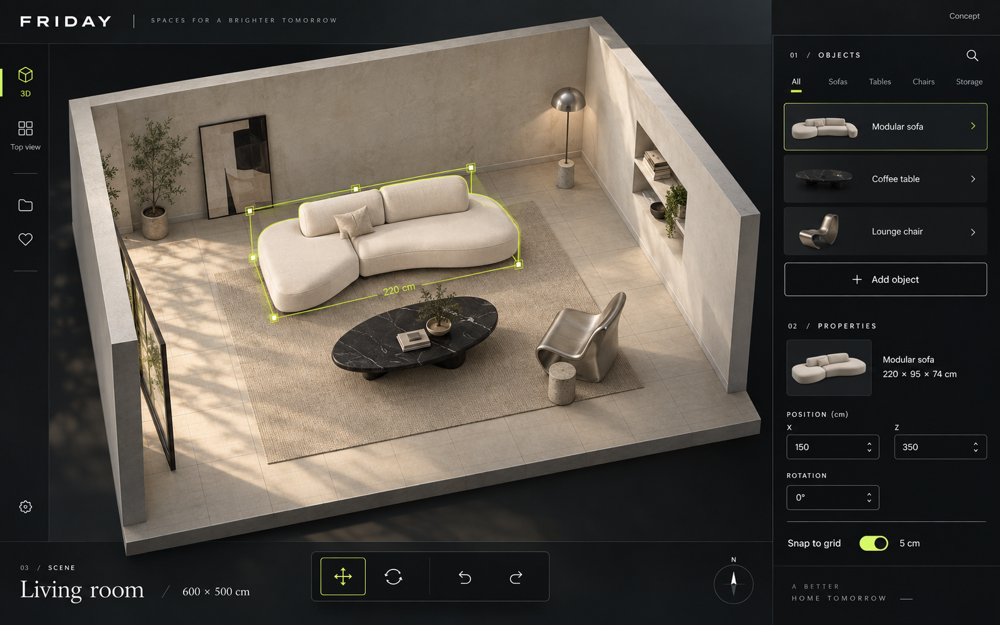
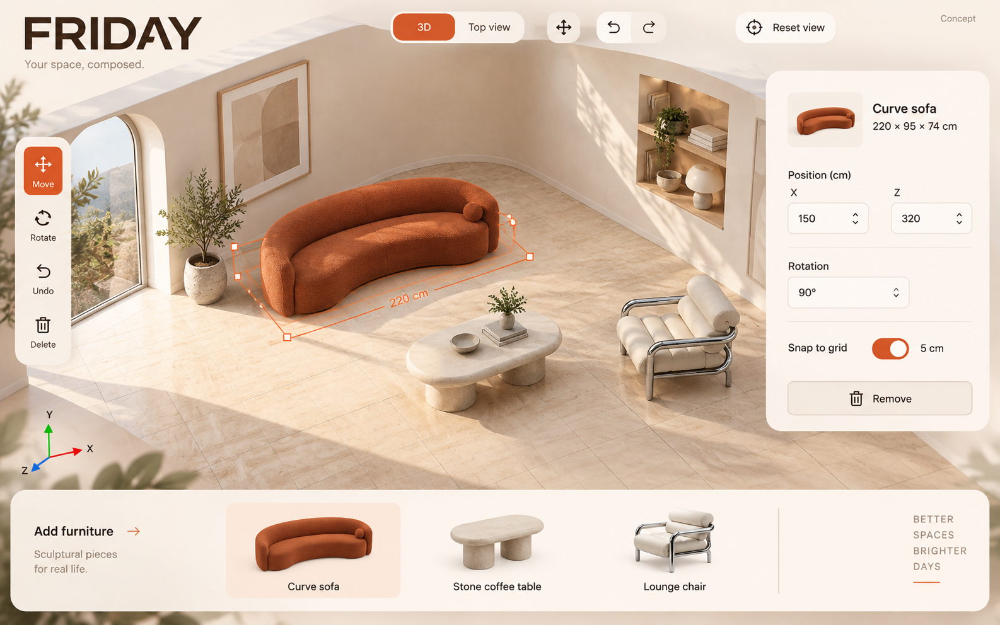
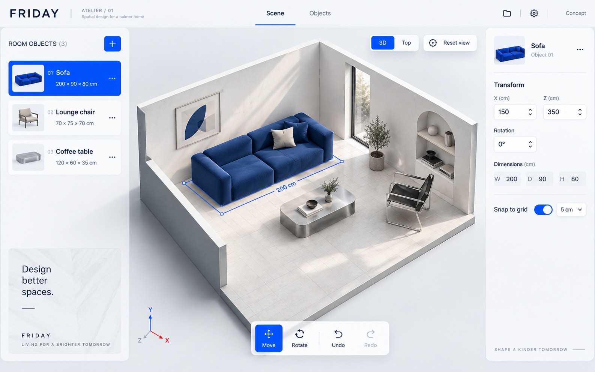

# Frontend visual directions

2026-09-19 · Three generated design concepts, not implemented screens or approved scope changes.

Selected by the user: **Atelier interface with Noir's 3D room style and practicality**. Follow the [combined reference and implementation guidance](selected-direction.md); the three images below document the explored alternatives.

Generated with the built-in image-generation tool from the first room-editor concept after the user requested a more futuristic modern-furniture style. All three are saved here for review. Text, geometry, ruler scales, and furniture dimensions in these generated images are illustrative; the implementation must follow the [foundation plan](../3d-engine-plan.md) and [asset handoff](../3d-object/collaborator-handoff.md).

| Direction | Visual character | Implementation takeaways |
| --- | --- | --- |
| 01 Noir | Charcoal shell, chartreuse selection, stone and chrome | Strongest futuristic identity; maintain readable dark controls and room visibility |
| 02 Solstice | Warm ivory, orange upholstery, sculptural pieces | Most furniture-brand character; floating panels need viewport space checks |
| 03 Atelier | Cool white, cobalt accents, precise controls | Clearest technical workspace; reduce double-sidebar width on smaller laptops |

The room styling and added decor are visual inspiration, not additional foundation requirements. None of these pictures proves renderer performance or asset availability. Do not implement decorative slogans, additional panels, or extra actions merely because the generator drew them. Keep foundation functionality and the user's eventual selected visual direction.

## 01 — NOIR / architectural studio

Generation prompt

Create one premium high-fidelity FRIDAY furniture room-editor desktop UI concept, landscape 16:10, full application screenshot edge-to-edge without hardware or browser chrome. Use the supplied earlier concept ONLY as reference for the product functionality and approximate room editor purpose; completely reinvent its visual style, layout and art direction. User rejected that version as barebones/bland. New version must feel like a distinctive futuristic modern furniture design brand and a polished spatial editing product. Maintain readable working controls and a large real 3D room viewport (at least 65% screen). Functionality visible: 3D / Top view toggle, orbit/reset, object selection, move/rotate/undo, concise selected furniture properties in centimeters, snap 5 cm, and add object. No AI chat, no payments, no heatmaps or valid-space overlays, no giant landing-page slogans, no fake code, no random dashboard charts. Beautiful believable furniture material quality, purposeful room composition, clean icons, sharp readable text. Include FRIDAY branding and a small 'Concept' label. This is a design mockup, not a build screenshot. Furniture is contemporary sculptural furniture, not generic office furniture. Full coherent application, one screen per image, not a contact sheet.
DIRECTION 01: NOIR, a cinematic architectural design studio. Deep charcoal and ink-black application frame, titanium-gray hairline rules, high contrast bone-white typography, restrained electric chartreuse accents for selection and active controls only. Distinctive understated FRIDAY wordmark, editorial spacing and sophisticated tiny section numbers. The huge central scene is a bright tactile limestone/concrete room inside the dark shell; elevated cutaway angle, warm indirect light, understated floor grid. Show an asymmetrical sculptural ivory low modular sofa, black polished stone oval coffee table, and one brushed-steel sculptural lounge chair. Realistic fabric folds, metal, stone, soft contact shadows. Place a fine chartreuse outline around selected sofa and a small '220 cm' annotation. Slim left vertical icon rail. A generous but compact dark right inspector integrated into frame: '01 / OBJECTS', elegant object rows, 'Modular sofa', '220 × 95 × 74 cm', 'POSITION', X and Z fields, rotation '0°', Snap '5 cm'. Bottom-center dark floating tool dock with clear move/rotate and undo/redo glyphs. Bottom left room title 'Living room' and '600 × 500 cm' in refined typography. This should feel premium architectural software from a furniture design house; futuristic through precision and materials, not sci-fi HUD clutter. No neon everywhere, no gradients behind every panel, no generic card grid.

## 02 — SOLSTICE / future furniture showroom

Generation prompt

Create one premium high-fidelity FRIDAY furniture room-editor desktop UI concept, landscape 16:10, full application screenshot edge-to-edge without hardware or browser chrome. Use the supplied earlier concept ONLY as reference for the product functionality and approximate room editor purpose; completely reinvent its visual style, layout and art direction. User rejected that version as barebones/bland. New version must feel like a distinctive futuristic modern furniture design brand and a polished spatial editing product. Maintain readable working controls and a large real 3D room viewport (at least 65% screen). Functionality visible: 3D / Top view toggle, orbit/reset, object selection, move/rotate/undo, concise selected furniture properties in centimeters, snap 5 cm, and add object. No AI chat, no payments, no heatmaps or valid-space overlays, no giant landing-page slogans, no fake code, no random dashboard charts. Beautiful believable furniture material quality, purposeful room composition, clean icons, sharp readable text. Include FRIDAY branding and a small 'Concept' label. This is a design mockup, not a build screenshot. Furniture is contemporary sculptural furniture, not generic office furniture. Full coherent application, one screen per image, not a contact sheet.
DIRECTION 02: SOLSTICE, warm optimistic retro-futurist furniture showroom. Ivory and pale sand application canvas, oversized but controlled dark chocolate FRIDAY wordmark in a wide geometric sans, very light peach/champagne frosted floating control panels, bold burnt-orange/coral highlights and small cobalt active details. Strong sophisticated editorial composition, not standard SaaS sidebar layout. A beautiful expansive sunlit 3D cutaway room takes most of the display; curved rear corner, warm travertine floor with thin discrete working grid, sculptural low rust-orange boucle curved sofa, a satin-chrome tubular lounge chair, rounded pale stone coffee table. Rich tactile modern furniture, warm shadows, effortless minimal luxury. Large room viewport central/right; short elegant object shelf along bottom with three small actual furniture thumbnails and names, no nested cards. Selected-object compact floating panel upper-right with title 'Curve sofa', '220 × 95 × 74 cm', Position X / Z cm, 'Rotate 90°', Snap '5 cm'; small coral outline on floor around sofa. Top-left under brand small title 'Your space, composed.' (only one compact phrase, not a landing-page hero); top center pill-shaped '3D / Top view', top-right understated 'Reset view'. Tool rail with strong simple icons left of scene. Keep labels readable and whitespace intentional; rounded panels with subtle translucency, not extreme glass. This is a working room editor viewed on a laptop, not a furniture ecommerce landing page. Feel fresh, expressive and expensive, markedly different from black technical UI.

## 03 — ATELIER / precision workspace

Generation prompt

Create one premium high-fidelity FRIDAY furniture room-editor desktop UI concept, landscape 16:10, full application screenshot edge-to-edge without hardware or browser chrome. Use the supplied earlier concept ONLY as reference for the product functionality and approximate room editor purpose; completely reinvent its visual style, layout and art direction. User rejected that version as barebones/bland. New version must feel like a distinctive futuristic modern furniture design brand and a polished spatial editing product. Maintain readable working controls and a large real 3D room viewport (at least 65% screen). Functionality visible: 3D / Top view toggle, orbit/reset, object selection, move/rotate/undo, concise selected furniture properties in centimeters, snap 5 cm, and add object. No AI chat, no payments, no heatmaps or valid-space overlays, no giant landing-page slogans, no fake code, no random dashboard charts. Beautiful believable furniture material quality, purposeful room composition, clean icons, sharp readable text. Include FRIDAY branding and a small 'Concept' label. This is a design mockup, not a build screenshot. Furniture is contemporary sculptural furniture, not generic office furniture. Full coherent application, one screen per image, not a contact sheet.
DIRECTION 03: ATELIER, a futuristic precision workspace for contemporary furniture. Restrained glacier-white, cool pale gray, graphite typography, vivid ultramarine-blue as the sole main accent. Bold compact typographic labels with technical monospace measurements, a beautiful orderly grid, squared panels with slight rounding, crisp high-density but very legible controls. Strong distinctive white FRIDAY header and 'ATELIER / 01' small workspace identifier. Main room shown in elegant axonometric/isometric cutaway perspective centered against a pale cool-gray infinite ground, architectural white walls and faint cyan-gray measurement grid, convincing photorealistic contemporary furniture: deep cobalt-blue soft modular sofa, cantilever chrome leather chair, brushed-aluminum low coffee table with rounded corners. Furniture richer and more designed than generic home-furnishing models. Thin ultramarine footprint outline and centimeter rulers around selected sofa. Top horizontal tab strip 'Scene', 'Objects'; compact '3D / Top' controls aligned right above viewport. A slim left layer/object panel with clean numbered rows '01 Sofa', '02 Lounge chair', '03 Coffee table', one blue selected row. A small floating right inspector with 'Transform', X and Z numeric centimeter fields, 'Rotation 0°', 'Snap 5 cm'. Center-bottom precise horizontal move/rotate/undo toolbar. Balanced asymmetric layout, room consumes at least two thirds of view. Sophisticated blue industrial-design energy, approachable and premium, not a spaceship HUD, not generic Figma imitation, no excessive pills. Make the room, controls and modern furniture visually arresting together.

