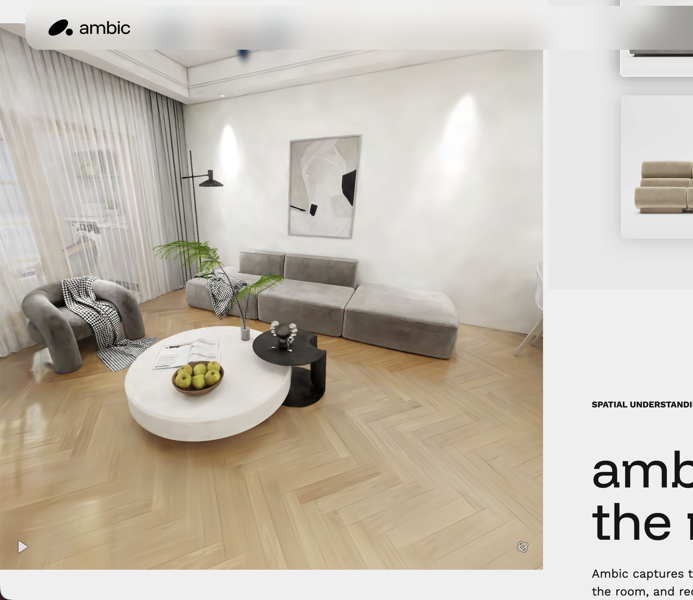

# First-person room editor: PlayCanvas + SuperSplat

2026-09-19 · Sin · Implementation roadmap · Branch: `codex/gaussian-splatting`

This is the implementation plan for the selected pivot. It supersedes the renderer and room-box direction in the earlier [foundation plan](../3d-engine-plan.md) and the historical mesh-first sections of the [reconstruction research](research-and-integration-plan.md). The prepared Studio 11 slice is now implemented; see [current implementation and limits](playcanvas-implementation.md). The Three.js baseline remains available through `?legacy`. Unchecked future gates below are still plans.

## Outcome and visual authority

Build a photographic room the shopper can look around and walk through, then place separate furniture into it. The user confirmed: **keep Atelier liquid-glass panels and Mori; match Ambic's room view and interactions.** The primary surface is an editor with an immersive room view, not a scrolling marketing page.



Image provenance: screenshot supplied by the user in this task, preserved unchanged. It is a visual reference, not a licensed room asset or evidence of our implementation.

The coordinator inspected [Ambic](https://www.ambic-spatial.com/) and its linked [SuperSplat embed](https://ambic-website-embed.netlify.app/). The public embed exposes camera playback/pause and direct camera dragging; the room remains the dominant visual surface. Editable product insertion, walking collision and spatial validation were not demonstrated in this public view. Match the observed presentation; the editing and navigation behaviours below are explicit FRIDAY design decisions. Do not infer Ambic's private backend or reuse its room data.

Match the interior perspective, warm daylight, believable scale, continuous floor/walls, close furniture/material detail and restrained camera movement. Replace the elevated dollhouse/Noir box, slab and exterior orbit as the default. Keep FRIDAY identity, cream/sand glass, espresso text, terracotta active accents and PP Mori from the [selected design](../design/selected-direction.md). Do not tint a captured room orange to match the UI.

Exact room appearance depends on the supplied scan, camera coverage and furniture quality. A different licensed room can match this presentation without containing Ambic's architecture or objects.

## The complete first milestone

One local prepared room, fixed scanned furniture, one production GLB plus the known-size fixture, eye-level exploration, catalogue selection, move/rotate/remove, green/red/amber placement preview, undo/redo, save/reload, exact-pose agent validation and useful revision-specific images. Keep numeric centimeter editing available in the glass inspector.

This milestone includes the entire viewer-to-Django workflow. Automatic reconstruction from arbitrary video, multi-floor navigation, physically exact mesh collisions and execution of every natural-language spatial constraint are later phases. They must not delay proving one complete room.

## Layout and interaction

At the initial 1366 × 768 laptop target, use a full canvas behind a compact 52–60 px glass header. Overlay one 280–320 px right panel inset from the edges; collapse it for inspection. Keep room view/reset controls near the top and a small action dock near the bottom. The catalogue and selected-object inspector reuse the same panel rather than competing as two permanent sidebars. No page scroll while manipulating the room; the panel can scroll independently.

The first frame is an approved interior viewpoint, with the lens level or slightly downward. Proposed starting tuning: 155–165 cm eye height, 55–65° vertical field of view, no roll, head bob, jump or forced autoplay. Tune against the actual scan; these are starting values, not measurements from Ambic. A short optional room tour can reuse reviewed camera bookmarks after core editing works. Manual input immediately stops a tour or transition.

| State | Inputs and feedback |
| --- | --- |
| Explore, initial | Cursor visible. Drag the background to look around; clicking a movable product selects it. A small “Walk” action enables movement. No automatic pointer lock on page load. |
| Walk | Explicit click enters mouse-look/pointer lock where supported; WASD moves on the reviewed floor. Offer drag-look plus visible step/turn controls for trackpad or denied pointer lock. Escape, blur, an open panel/dialog or input focus releases movement and clears held keys. |
| Choose product | Search/filter in the glass panel. Results show real thumbnail, dimensions and model availability. Choosing an item starts a floor-placement preview, not a hidden add at fixed coordinates. |
| Place or move | Suspend camera dragging/walking. Project the cursor onto reviewed floor/support geometry, retaining the grabbed offset when moving an existing object. Preview a ghost product and footprint; confirm with click, cancel with Escape. Drag existing objects after a movement threshold so a simple click remains selection. |
| Validate | Green plus “Fits”; red plus a specific conflict; amber plus “Unverified area” or “Scale needed.” Colour is never the only signal. Keep original layout during invalid/unknown preview; one valid confirm creates one history entry. |
| Selected product | Show cm dimensions/position, rotate controls, snap, remove, undo/redo. Fixed scanned furniture is not selectable as editable furniture. |
| Loading/failure | Show truthful asset progress and retry. Do not enable placement before room context and geometry are ready. Failed furniture may use a labelled dimensioned proxy; failed room loading blocks the scan workflow. |

Grid lines are a local placement aid, not a permanent dense overlay covering the photographic room. Snap initially stays 5 cm; keep snap spacing and spatial-map resolution independent of render scale. A horizon/no-floor ray hit leaves placement inactive with guidance rather than projecting furniture to infinity.

Keep the approved glass formation animation: the pane grows from its trigger, settles, then reveals stable text. Use transform/opacity/clip shape with static blur first; no full-screen refractive shader pass in the critical path. Honour reduced motion, visible focus, keyboard controls and an opaque readable glass fallback. Never add spring lag to the actual furniture pose.

## Runtime choice

Use **one imperative PlayCanvas application hosted by React**. React owns UI and committed editor state; PlayCanvas owns camera, asset/entity lifetime, hit testing and rendering. SuperSplat is a preparation/editor tool, not an iframe containing the application. This allows our real GLB entities and existing commands/captures to share the room.

`@playcanvas/react` is supported and compatible with the current React family, but it does not remove the need for direct camera/layer/readback control. Avoid adding it and a generic multi-renderer abstraction for this migration. One small runtime interface is enough:

```ts
interface RoomRuntime {
  setSnapshot(snapshot: SceneSnapshot): void;
  setInteractionMode(mode: 'explore' | 'walk' | 'place'): void;
  setSelection(instanceId: string | null): void;
  resetCamera(): void;
  capture(job: CaptureJob, signal: AbortSignal): Promise<CaptureResult>;
  dispose(): void;
}
```

These are proposed signatures, not existing types. Runtime callbacks report selection, placement previews, complete edit proposals, load status and errors. Only confirmed edits enter `useSceneEditor`; transient camera/preview motion stays out of React render loops. Parent owns the runtime; child controllers cannot create a second application.

On confirmation, submit the proposed edit through the authoritative command endpoint with expected revision and an idempotency key. Keep the ghost visibly pending until acceptance; then apply the returned snapshot and add exactly one history entry. Rejection or conflict removes the pending preview, preserves the committed layout/history and displays the reason. Accepted commands must not trigger a duplicate debounced snapshot write. Undo/redo and numeric edits use the same acceptance/reconciliation path; revalidation may reject a historical pose after the room changes. Coordinator and Agent C must define this callback/sync contract before Agent B wires interactions. The current local-commit-then-save flow is insufficient for this guarantee.

Pin an exact stable PlayCanvas version during the proof and verify required APIs against its installed types/source. The inspected stable listing was 2.22.2 while current main/docs include later behaviour; do not assume examples from main are version-compatible. Prefer the verified WebGL2 path initially, with WebGPU selected only after the same visual/capture checks pass. Do not claim both backends are qualified after testing one.

## Asset gate: first work before the full port

Timebox obtaining/preparing a candidate to 30–60 minutes. [Studio 11](https://superspl.at/scene/c37cb759) is the first aesthetic candidate; it is synthetic, lists five million splats and requires login to download. [The room shortlist](research-and-integration-plan.md#existing-room-splats-for-the-first-demo) has real-scan and smaller alternatives. No candidate is downloaded or performance-qualified yet.

1. Obtain an actual Gaussian PLY or SOG package, preserve source/author/license and inspect the file. Ordinary XYZ PLY is not a Gaussian model.
2. Open in SuperSplat, remove distracting floaters/outside capture fragments, align up/floor, confirm scale from a known measurement and set an interior spawn. Never infer accurate centimeters merely from visual plausibility.
3. Export a compact `.sog` for the first room. Retain source PLY outside runtime packaging when available. If necessary, generate Streamed SOG with its complete `lod-meta.json` and relative assets; simply renaming a file does not create LOD.
4. Generate a draft uncarved voxel/triangle reference locally with SplatTransform, following the [surface-generation methods](surface-generation-methods.md). Review a usable floor polygon and fixed obstacles/unknown areas, then build the small authoritative spatial fixture. Generated geometry cannot certify all free space; keep capsule-carved walking data separate from furniture-placement evidence.
5. Render the room plus the known 2 m GLB fixture and one furniture GLB in PlayCanvas. Check floor contact, correct scale, foreground/background occlusion and one real PNG.
6. Record actual device/browser, file size, splat count, load time and a 60-second interior walkthrough. Target sustained responsive interaction around 30 FPS or better; inspect frame pacing rather than only an average.

Start with DPR 1 and restrained quality settings. Increase quality from measured headroom. Test opaque GLBs first; glass/blended material ordering, mirrors and thin plants are explicit visual cases. Lower splat count/LOD/resolution before adding postprocessing. File size alone does not predict GPU memory or frame time.

If no usable asset is available in the timebox, the team may build a clearly labelled synthetic PlayCanvas harness while the asset gate remains open. It is not a completed Gaussian-splat demonstration. Do not make a room package depend on a hotlinked gallery or extract Ambic's private asset files.

## One room package and one coordinate contract

First schema file to implement: `shared/room-scan.schema.json`, revising the proposal in the research doc rather than adding a competing format. Prepared fixtures live under `shared/rooms/<room-id>/<revision>/`. Large source captures remain outside Git; runtime asset inclusion follows the measured demo budget.

| Manifest field | Contract |
| --- | --- |
| `schemaVersion`, `roomId`, `geometryRevision` | Versioned shape and immutable physical room revision; separate from editable layout revision |
| `units`, bounds, `floorYcm`, `floorPolygonCm` | Canonical centimeters, +Y up, XZ floor; rectangular bounds enclose but do not replace the usable polygon |
| `calibration` | Confirmed/assumed/unconfirmed status, known distance and provenance. Assumed/unconfirmed cannot produce verified placement success. |
| `visual` | `kind: splat`, format, local runtime URL, hash and explicit asset units/transform |
| `spatial` | Map URL/hash, `cellSizeCm`, origin, dimensions, encoding, free/blocked/unknown states and obstacle identifiers |
| `defaultCamera`, optional bookmarks | Interior position in cm, yaw/pitch, bounded FOV, reviewed against the navigation map |
| `collision`, optional | Reviewed collision mesh/SVO reference for more advanced walking; never silently substituted for the placement map |
| `semantic`, optional | Reviewed wall/opening annotations with stable IDs, labels and centimeter geometry; missing categories expose empty reference lists, never fixture IDs or guessed windows/doors |
| attribution/source | Source URL, creator, license and preparation/modification notes |

Prefer normalizing prepared visual/collision assets offline to meters with a shared origin. If a source transform is retained, record and apply the same transform to every artifact; do not rotate/scale the viewer independently of validation geometry. Spatial JSON remains cm. The preparation checker validates the package and all relative asset references before serving it.

Preserve the user's current conversion:

```text
render position = centimeters / SCENE_UNIT_CM
meter GLB scale = 100 / SCENE_UNIT_CM
catalogue dimension in cm = dims_mm / 10
default SCENE_UNIT_CM = 5
```

A 220 cm sofa is 44 render units at 5 cm/unit and 22 at 10 cm/unit; its physical pose and validity must be identical. Camera speed, eye height, collision radius, clipping distances and any gravity use the same conversion. If Ammo is later used, 981 cm/s² gravity becomes `981 / SCENE_UNIT_CM` render units/s²; do not copy a meter-tuned controller unchanged. Renderer scale does not change the default 5 cm occupancy cell or chosen snap step.

Extend existing Vite shared asset serving for prepared room packages during development/build. Keep room manifests/spatial maps available to Django too. Real user uploads later belong in ignored, session-scoped backend media with bounded file access; the fixture Vite plugin is not an upload system.

## Navigation and placement geometry

### Confirmed: freeze detected room surfaces

The user explicitly selected a fixed-room model. After capture, calibration and review, freeze the room splat transform, floor/support geometry, walls and existing furniture obstacles into one immutable room revision. Sensor updates belong to preparation; they never change the active editor's surfaces in the background. Existing room objects cannot move, deform or be deleted through furniture commands.

Only imported furniture instances change pose. For the first milestone, their floor-contact pivot stays on the approved floor; translation and rotation are validated against the frozen room and other added GLBs. Use constrained placement and rejection rather than gravity, pushing, bouncing or general rigid-body simulation. Floor grid origin and spacing remain fixed while the visible placement patch follows the selected object. Unknown regions stay unavailable.

A new scan or manual correction produces a new room revision with explicit activation and layout revalidation. Freezing simplifies runtime interaction; initial visual/geometric alignment and correct occlusion still need the proof below. It does not turn unreviewed inferred geometry into measured truth.

### Surface agreement is an integration gate

The visible splat, measured room geometry and new GLB must agree locally, not merely share nominal units. The splat supplies captured appearance. A reviewed floor/obstacle model supplies support and placement constraints. An optional finer proxy supplies visual depth/shadow information. Collision geometry can conservatively enclose an obstacle; a visual occluder must follow its visible silhouette more closely. Do not reuse inflated collision boxes as invisible visual walls.

Prefer floor/mesh evidence from LiDAR captured with the same RGB frames and tracking session. Align that evidence with the splat, then inspect a wireframe overlay at multiple room positions and camera angles. A single global scale/rotation/translation cannot repair spatially varying reconstruction drift. Record alignment error against independent measurements; unknown or poorly aligned regions remain unavailable for verified placement. The 5 cm grid resolution is not a claim of 5 cm measurement accuracy.

Proposed first-room qualification target: no more than 5 cm error at independently checked dimensions/locations in the intended placement region. This is an acceptance target, not achieved accuracy or a bound for unchecked surfaces. Check wall spans, a diagonal, floor contact and existing-furniture clearances; exclude the measurement used to establish scale from independent verification, and report worst error as well as typical error. Repeat the capture to expose unstable results. Set placement clearance margins from observed geometry/alignment uncertainty and product-dimension uncertainty; unknown regions are not made valid by adding a fixed buffer. Freezing geometry prevents runtime changes but preserves any original error.

Published evidence is context, not our benchmark: an [iPhone 13 Pro office-scan study](https://rgg.edu.pl/pdf-215882-133579?filename=3D-Building-documentation.pdf) reports a 4.4 cm standard deviation of dimensional differences and a largest diagonal difference of 9.4 cm for its tested workflow. A [RoomPlan-based building comparison](https://www.iaarc.org/publications/fulltext/ISARC2026_1132.pdf) also found positional drift and wall-placement limitations. These test different capture/software pipelines from ours and do not establish an end-to-end error bound after splat alignment.

| Interaction risk | First implementation and proof |
| --- | --- |
| Chair floats or penetrates the visible floor | Fit/review a supported flat floor, normalize GLB contact pivot, and inspect contact near/far across the usable region. Reject unsupported uneven areas. |
| Chair is accepted inside a scanned sofa | Validate against reviewed fixed-obstacle geometry plus other GLBs, including uncertainty margins. Display the tested footprint and reason. |
| Grid/chair appears through a scanned obstacle | Qualify opaque GLB compositing first. Where visual depth is required, use a dedicated reviewed proxy/depth pass. Verify that the proxy does not incorrectly erase splats or create hard silhouette halos; forcing overlays on top is not a fix. |
| GLB looks pasted into the scan | Match exposure and approximate captured illumination. Test a floor shadow catcher for contact, preserving existing baked room lighting. |
| Mirrors, glass or thin foliage blend incorrectly | Treat these as separate qualification cases; constrain the first demonstration to qualified opaque furniture and viewing/placement regions. Static captured reflections do not automatically update for new GLBs. |

Current PlayCanvas documentation describes [depth proxies](https://developer.playcanvas.com/user-manual/gaussian-splatting/rendering-architecture/renderers/) and [shadow catchers](https://developer.playcanvas.com/user-manual/gaussian-splatting/building/shadows/): splats can cast shadows, but do not directly receive new object shadows. [Proxy-based relighting](https://developer.playcanvas.com/user-manual/gaussian-splatting/building/relighting/) is an additional rendering technique, not an automatic property of mixed scenes; it stays outside the first proof. Verify these APIs/behaviours against the selected installed engine version.

Before the full port, test one actual splat, a known-size GLB and one opaque furniture asset: floor contact at several positions; partial occlusion in front of/behind a fixed object; rejection at a wall/obstacle; grid stability while walking; and a shadow/contact image from multiple viewpoints. Check captures as well as the live view. A visually attractive room without this evidence does not pass the asset gate. No such mixed-scene prototype has been run yet.

For one flat room, start with constrained floor walking: a swept camera-radius footprint against reviewed boundary, blocked/unknown cells and newly placed furniture. Bound frame delta/substeps to prevent tunnelling at low FPS. Eye height is fixed above the floor, spawn is validated, and reset returns to that safe spawn. This is conservative 2.5D walking; it does not simulate stairs, jumping, falling or under-table clearance.

This path avoids making Ammo integration a dependency of the first complete room. The official PlayCanvas first-person example with SOG, collision GLB and Ammo remains the reference if arbitrary floor geometry is subsequently required. Walking collision and furniture fit answer different questions; a human-sized carved walkable volume cannot define where a sofa fits.

Extend the existing SAT footprint validator with the reviewed floor polygon/map. Check every cell intersected by the rotated footprint, including thin features crossed by edges. Preserve height checks and overlap with other new furniture. Missing geometry is unknown, not free. User and agent edits both use authoritative backend validation; frontend checks are responsive previews of the same versioned data.

Retain `try_place` exact-coordinate, dry-run, idempotency and unchanged-on-error semantics. Add reason codes for `static_obstacle`, `unknown_space`, `scale_unconfirmed`, `unsupported_floor` and `room_revision_conflict`; include obstacle IDs and human-readable explanations. An attempted move does not silently snap, find another slot or mutate history unless that separate operation was requested.

## Server context, persistence and catalogue

Current blockers are concrete: `useSceneSync.parseSceneSnapshot` rejects any room/product outside imported fixtures; `App.tsx`, `Scene.tsx` and backend `scene_service.py` also depend on those fixtures. Replace that authority with the validated server snapshot before integrating a scanned room. Preserve sync race protection, CSRF, revision checks, receipts and reducer/history behaviour.

Add an active immutable room reference to `SceneLayout` with a migration default preserving existing demo layouts. Activate a new room explicitly, increment layout revision and revalidate/clear incompatible placements; never silently reuse poses across a changed origin/scale. Frozen capture snapshots retain their original room reference and resolved products.

Create narrow catalogue adapters in `backend/api/scene_catalogue.py` and `frontend/src/scene/catalogueAdapter.ts`. Preserve listing IDs, resolve authoritative server dimensions/model URLs, convert mm to cm once, and send only featured/placed/requested product metadata with the scene rather than all 12,000 seed products. Never trust client-supplied dimensions. `model_url: null` remains a valid listing with a labelled dimensioned proxy and capture warning. Add a generic proxy fallback beyond the existing sofa/table/chair kinds.

The `/api/compile` endpoint currently uses `MOCK_ROOM` and returns `place[]` without executing it. The migration must not imply that importing search makes those placement clauses work. Supply session-derived semantic references through a small coordinator-owned change in `catalogue/views.py` once room refs exist. Keep the DSL/catalogue internals in their teammate's lane. Ship search → choose item → exact-pose `try_place` first; unsupported semantic clauses/references return explicit errors. Full natural-language layout solving remains separate work.

Semantic references come only from the manifest's reviewed annotations. A floor polygon alone does not identify a door, window or named wall. Until annotations exist, compile receives empty lists for those categories and explains that requested references are unavailable; it must never fall back to `MOCK_ROOM`.

## Agent screenshots and enclosed rooms

Keep the capture queue, session ownership, revisions, leases, idempotency and PNG verification. Replace the renderer; do not copy the existing two-animation-frame readiness rule or allocate a second full splat application.

| Requested view | Planned behaviour |
| --- | --- |
| Perspective, default | Resolve and freeze the room's approved interior camera at enqueue time |
| Perspective, custom | Add a tagged interior pose/preset with cm position, yaw, pitch and bounded FOV; validate the camera is in supported space |
| Legacy azimuth/elevation | Preserve the existing fixture-room inspection behaviour. For scans, support only when a qualified inspection/cutaway setup exists; otherwise return an explicit unsupported-camera error rather than photographing the outside wall. |
| Top | First deliver a clearly labelled `spatial_plan`: floor boundary, fixed obstacles, unknown coverage and exact placed footprints. A photographic cutaway requires a separately qualified roofless/clipped splat path. |

For scanned rooms, make the representation choice explicit in the request/agent adapter and response. Do not silently replace a requested photographic top image with a diagram. An old request without a valid scanned-room representation can return `capture_representation_required`; fixture-room callers keep their current behaviour. Update Python adapter, frontend client, panel and docs together. Include `representation`, resolved camera, room revision/hash and layout revision in ready metadata.

Extend strict request/job parsers and capture idempotency records together. Bind the request to representation, tagged camera options, immutable room revision, layout revision and image dimensions; resolve default cameras once and retain the resolved pose and room hash with the frozen job. A retry reuses that receipt rather than resolving defaults against a newer room. Reusing an idempotency key with changed representation or camera must conflict, never return an image with different semantics. Add regressions for the same key with different representation and for a default-camera retry after the live room changes.

Use one graphics device with a capture camera/render target and isolated frozen furniture entities, sharing static room/GLB resources. Queue captures serially. Live edits must not alter the frozen capture; camera/UI state is restored in a `finally` path if a short render suspension is required. Preload before claiming where possible. Wait for loaded GLBs and actual splat readiness/sorting for the capture camera/layer; use `frame:ready` only if supported by the pinned version and verify its semantics. The official SuperSplat capture path is a readback reference.

Current limits are a 15-second frontend rendering timeout, 30-second lease, 120-second job expiry, 1.5 MiB PNG cap and 1.8-million-pixel cap. Qualify a 1024 × 768 photographic PNG early. Do not simply lengthen the frontend timeout past its lease. If measured encoding/load needs exceed limits, coordinate backend/client changes, lease renewal and Django request-size limits; do not silently downscale a requested screenshot or upload an oversized body. Failure must return an error, never a successful blank/partial room.

## Code migration and ownership

Keep the current engine behind Git history and a short-lived development fallback while the first slice is proven. Ship one default renderer; remove Three/R3F only after old capture, math imports, fixtures and tests are ported. Do not maintain two production engine stores.

| Owner | Exclusive files/work during implementation |
| --- | --- |
| Coordinator | `App.tsx`, `Scene.tsx` host integration, `Icons.tsx`, `style.css`, `CapturePanel.tsx`, `capture.css`, `scene/types.ts`, existing `scene/units.ts`, `scene/captureClient.ts`, `scene/useCaptureWorker.ts`, `scene/catalogueAdapter.ts`, `shared/room-scan.schema.json`, package/lock/Vite/shared-asset scripts, indexed docs and TODO. Also the narrow `catalogue/views.py` session-ref hookup after agreeing the backend helper. |
| Agent A: runtime/assets/capture | New `scene/playcanvas/runtime.ts`, `assets.ts`, `room.ts`, `lighting.ts`, `capture.ts`, replacement capture camera internals/tests and `SceneCapture.tsx`. Own application/device/resource lifetime, readiness and disposal. Publish the runtime handle before Agent B integrates. |
| Agent B: camera/furniture interactions | New `scene/playcanvas/navigation.ts`, `interaction.ts`, `furniture.ts`, `overlays.ts`, performance probe and focused input tests. Replace Three event/raycast drag code. Consume Agent A's loader/root/camera; never create another application or committed editor store. |
| Agent C: spatial/server context | `scene/placement.ts`, `useSceneSync.ts` and relevant tests; `backend/api/scene_service.py`, new `scene_catalogue.py` and room loader, capture service/tool changes, model migrations and Python tests; concrete `shared/rooms/` manifest/spatial fixtures after schema freeze. Do not modify catalogue DSL/search internals. |

Unchanged unless a failing integration proves otherwise: `scene/commands.ts`, `useSceneEditor.ts`, reducer/history semantics, furniture source assets, search/Elastic DSL internals and the separate `codex/realistic-couch-model` worktree. Agent A and B coordinate GLB ownership: A caches container resources; B creates/removes selectable instances and releases its references. One instance disappearing must not destroy another's resources.

Before parallel coding, coordinator lands the room/snapshot/unit/capture types and callback contract. Agent C validates server context while Agent A publishes a minimal runtime handle; Agent B then consumes that handle. No two agents edit App, shared types or dependency files. Agents report status, files, checks and blockers for the coordinator-owned work log.

## Sequence, effort and decision gates

These are planning ranges for a prepared-room hackathon slice, not performance or delivery promises. Allow roughly **6–9 hours once a usable asset is available**, with room for data/API surprises. A view-only render can appear much earlier than a reliable editor.

| Order | Timebox | Exit condition |
| --- | --- | --- |
| 0. Asset qualification | 30–60 min, extend only for a specific identified issue | Supported local file, permission to use, scale/floor/spawn, one GLB, useful screenshot and measured laptop pacing |
| 1. Freeze contracts | 20–30 min | Shared room schema, server snapshot, physical units, capture representation and runtime callbacks agreed |
| 2. Parallel build | 2–3 h | A: room/asset host; B: look/walk/place; C: authoritative room/product context and spatial validation; coordinator: glass shell/catalogue hookup |
| 3. Integrate and qualify captures | 1.5–3 h | End-to-end edit/save/reload/agent attempt plus frozen interior and labelled top capture |
| 4. Demo rehearsal and fixes | Reserve 1 h | Laptop controls, failure states, performance, screenshot pixels and automated regressions verified |

Do not count the same asset proof twice: if phase 0 already produces an interior capture, reuse that rendering path in phase 3. Defer optional tour, advanced glass, transparent GLB effects and automatic collider generation when core tests are not yet green.

After this milestone, implement local input preparation as a separate bounded pipeline: phone video → FFmpeg sharp frames → COLMAP cameras → native Brush training → SuperSplat cleanup/export → calibration/spatial review → the same room package. Add job progress/cancellation, local media storage and explicit activation only after one representative laptop reconstruction succeeds. SuperSplat/PlayCanvas alone do not turn an MP4 into a reconstructed room. Processing time, textureless walls and incomplete coverage remain experimental; do not promise Ambic's advertised capture speed. See the [local reconstruction research](research-and-integration-plan.md) for inputs, tool constraints and failure handling.

## Acceptance and stop conditions

- **Appearance:** compare the user reference, room asset and actual build at 1366 × 768 and the user's current laptop viewport. Interior framing, material exposure and glass readability are checked independently; a new room need not impersonate Ambic's architecture.
- **Scale:** 220 cm furniture, known 2 m fixture, camera speed/height and placement results stay physically consistent at both 5 and 10 cm/render unit. Check mm-to-cm conversion once.
- **Interaction:** mouse and trackpad; Explore/Walk/Place separation; Escape, blur, lost pointer, input focus and denied pointer lock. No jump through walls at long frame delta; cancel leaves scene/history unchanged.
- **Validation:** free area accepts; fixed couch/wall, rotated thin-obstacle intersection, unknown cell and unconfirmed scale reject with specific reasons. Frontend/backend share test cases. Dry run and idempotent retry preserve revisions.
- **Persistence/catalogue:** real listing IDs and room revisions survive reload; stale updates fail; missing-model proxy is labelled; unknown IDs or invalid authoritative dimensions fail. No fixture-only gate blocks the new room.
- **Captures:** inspect actual PNG pixels and dimensions; frozen revision after later edits; default/custom interior camera; explicit top representation; no opaque roof passed off as a useful plan. Exercise asset failure, cancellation, size cap, lease expiry and queue limits.
- **Assets/lifecycle:** duplicate GLB independence, remove while loading, retry, room change/unmount/HMR, resize and context loss. No leaked controller, asset listener, sorting worker or repeated GPU copies.
- **Performance:** record a sustained walk plus placement/capture run on the demo laptop, with exact room size/count, DPR and renderer. Reduce asset/quality when pacing fails; do not hide the failure with an averaged FPS badge.
- **Regression:** existing relevant scene/sync/history tests, combined API/catalogue tests, TypeScript/Vite build, Django checks/migration consistency, current docs index and console errors. The pre-migration baseline is 27 frontend tests and 117 backend tests with one live model test skipped.

Stop widening scope if there is no calibrated usable asset, scan/GLB occlusion fails, captures cannot fit the lease/memory budget, or the only collision data is unreviewed inference. Finish the prepared-room path before adding automatic ingestion or claiming safe placement in arbitrary scans.

## Sources and review record

- [PlayCanvas Gaussian splat building guide](https://developer.playcanvas.com/user-manual/gaussian-splatting/building/your-first-app/), [React asset loading](https://developer.playcanvas.com/user-manual/react/guide/loading-assets/).
- [Official first-person example](https://github.com/playcanvas/engine/blob/main/examples/src/examples/gaussian-splatting/first-person.example.mjs), [SplatTransform collision generation](https://developer.playcanvas.com/user-manual/splat-transform/collision/).
- [Splat rendering/depth behaviour](https://developer.playcanvas.com/user-manual/gaussian-splatting/rendering-architecture/renderers/), [performance](https://developer.playcanvas.com/user-manual/gaussian-splatting/building/performance/), [Streamed SOG](https://developer.playcanvas.com/user-manual/gaussian-splatting/building/lod-streaming/).
- [GSplat component system readiness API](https://api.playcanvas.com/engine/classes/GSplatComponentSystem.html), [SuperSplat capture source](https://github.com/playcanvas/supersplat-viewer/blob/main/src/capture.ts), [model authoring/GLB](https://developer.playcanvas.com/user-manual/assets/models/building/).

Three planning subagents independently reviewed renderer/source documentation, spatial/backend/catalogue contracts, and migration sequencing. Coordinator inspected the live Ambic embed and current UI/design sources, reconciled ownership and preserved the user's 5 cm render-scale requirement. Final contract review clarified server acceptance before local history commits, capture idempotency across representations/cameras, and reviewed semantic room references. All implementation file names and interfaces above are proposals. No runtime migration, model download, training run or device benchmark was performed during this planning pass.
