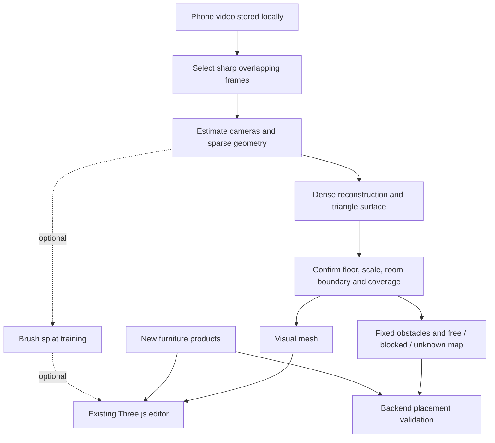

# Local phone-video room reconstruction and editor integration

2026-09-19 · Sin · Research and proposed implementation, not implemented or benchmarked.

## Selected direction: first-person PlayCanvas + SuperSplat

User decision, 2026-09-19: pivot the primary experience to first-person navigation and use PlayCanvas with SuperSplat. This supersedes the recommendation below to preserve Three.js/R3F as the rendering engine. The existing implementation is still Three.js; migration has not started.

- Runtime: PlayCanvas integrated with the existing React UI and Django contracts. Use the engine locally; a hosted PlayCanvas Editor project is not required.
- Fixed room: Gaussian splat prepared/cleaned with SuperSplat. Existing scanned furniture stays fixed. SuperSplat is the preparation tool; PlayCanvas owns runtime navigation and object placement.
- New furniture: continue Blender or generated-mesh cleanup followed by GLB export, measured centimeter metadata, and separate simple collision shapes. Keep `shared/models/furniture/<product-id>/model.glb` and existing browser URLs.
- Local reconstruction: evaluate video frames → COLMAP camera poses → Brush splat training. OpenMVS mesh reconstruction remains an optional geometry source/fallback. Calibration, coverage review and laptop feasibility testing are still required.
- Navigation: first-person perspective camera with collision against reviewed room geometry. Keep walking/navigation separate from furniture edit mode so mouse-look does not conflict with placement. Proposed controls: WASD + mouse look, Escape releases the pointer, and click-to-place preview with valid/invalid/unknown feedback. Final interaction details require implementation review.
- Preserve top/default/custom camera screenshots as agent inspection tools; first-person is the primary user navigation mode, not a removal of existing agent capture requirements.
- Retain centimeter API poses and physically scaled meter GLBs. Freeze the PlayCanvas runtime-unit/physics conversion before porting; do not silently reinterpret existing data or bake a different scale into collaborator models.
- First migration acceptance: one fixed splat room plus one selectable/movable GLB, correct scale and occlusion, safe first-person movement, backend validation and a screenshot. Reuse the Atelier/Mori glass shell.

PlayCanvas recommends GLB for models and supports a React integration. Collision geometry is configured separately and can use boxes, compound shapes or meshes. [Supported formats](https://developer.playcanvas.com/user-manual/assets/supported-formats/), [model authoring](https://developer.playcanvas.com/user-manual/assets/models/building/), [React and engine options](https://developer.playcanvas.com/user-manual/gaussian-splatting/building/your-first-app/), [collision components](https://developer.playcanvas.com/user-manual/editor/scenes/components/collision/)

## Existing room splats for the first demo

Checked 2026-09-19. We can test the renderer with an existing room before processing phone video. These are candidate fixtures, not imported or benchmarked assets.

| Candidate | Evidence and access | Fit |
| --- | --- | --- |
| [Studio 11](https://superspl.at/scene/c37cb759) by milanoski | Page lists 54.69 MB, 5 million splats and CC BY 4.0. Live preview shows a furnished cream-toned living space. Download button requires a SuperSplat login. Creator says the apartment originated in UE5 and collision was added in SuperSplat. | Recommended visual showcase candidate; synthetic scene, so it does not validate phone reconstruction. Laptop performance and exported collision data remain unverified. |
| [Modlinek Villa room 03](https://superspl.at/scene/ba4f566e) by Andrii Shramko | Page lists 65.65 MB and CC BY 4.0; captured with Xgrids PortalCam. Creator links a public scan pack. Verified the room's [export folder](https://drive.google.com/drive/folders/10pu6drTmpoyi2PyV841kDFEI7e6IAMIm) contains an 831.2 MB `!3Dexport.zip` with a Download control while signed out. | Recommended real-scan candidate. Read the included license and preserve creator attribution, including the requested LinkedIn link. Archive contents and precise export format were not inspected. |
| [Mirror Room v3](https://superspl.at/scene/0af8809a) by jpukka900 | Page lists a download, CC BY 4.0 and 21.84 MB. Creator identifies it as a Blender render. | Smaller transfer-size fallback; rendering cost is not established by file size. Synthetic rather than captured. |

SuperSplat's displayed scene size is not necessarily the source archive size. The studio's 5 million splats may need reduction for laptop performance. No files were downloaded, no account was created, and no asset format, real-world scale, collision export or local frame rate was verified. Obtain the actual package, inspect its splat format, establish scale and review collision data before treating it as an accepted fixture.

For CC BY assets, retain creator/source credit, a [license link](https://creativecommons.org/licenses/by/4.0/) and a description of modifications. The villa creator also points to a license inside the scan package; review that package before bundling it. Keep existing scanned furniture fixed and add our separate GLB for the first placement demonstration.

## Earlier research recommendation (superseded renderer choice)

The remainder preserves the original research and mesh-first implementation proposal for reference. Its Three.js migration decision and mesh-first sequencing are superseded by the selected direction above; its scale, coverage, spatial-map and revision requirements still apply. Estimates must be revised for the PlayCanvas controller/render/capture port before implementation.

Keep React, Three.js and React Three Fiber. Add a reconstructed, fixed room layer plus an independent spatial map. Continue placing new catalogue furniture as separate objects. Prefer a triangle mesh for the first integrated room and a conservative 5 cm floor occupancy map for placement. Gaussian splats are an optional visual layer after the mesh workflow works; voxels are useful spatial data rather than the main furniture-editor appearance.

For ordinary phone video processed entirely on laptops, evaluate **FFmpeg → COLMAP sparse reconstruction → OpenMVS dense reconstruction/meshing → normalized room package** first. This is our recommended engineering starting point, not a claim that it produces the best reconstruction on unseen footage. Run a bounded sample-video experiment before building the full import UI. Reconstruction quality and duration remain unmeasured.

The user clarified that the input is a phone walkthrough of a real room, everything already in that room stays fixed, and no cloud/NVIDIA service is available as a dependency. We do not need editable segmentation of every existing chair or couch. The current development host is macOS arm64. FFmpeg, COLMAP, OpenMVS, Brush and Blender were not on the inspected shell PATH; installation/setup is part of the estimate. Exact RAM/GPU capabilities and other teammates' laptops have not been verified.

## Representations and file formats

GLB is a container, not a competing reconstruction technique. A reconstructed triangle surface can be delivered as GLB just like manually authored furniture. glTF also supports points and other primitive modes, so a `.glb` extension alone does not prove a watertight triangle mesh exists. Inspect its contents. [Khronos glTF specification](https://registry.khronos.org/glTF/specs/2.0/glTF-2.0.html)

| Representation | Useful for | Decision for FRIDAY |
| --- | --- | --- |
| Textured triangle mesh | Visible surfaces, depth occlusion, raycasts, conventional rendering | First room visual; retain a simplified geometry copy |
| Point cloud | Reconstruction inspection and intermediate geometry | Debug preview; sparse points alone cannot certify empty space |
| 3D occupancy voxels | Solid/free/unknown queries and height-dependent collisions | Optional later refinement; do not render the room as thousands of separate cube objects |
| 2D floor cells with height/obstacle metadata | Fast furniture footprint tests and feasible-space overlay | First spatial representation for floor-standing furniture |
| Gaussian splats | Photographic room appearance | Optional visual upgrade with separate collision geometry |

These representations can coexist. Open3D can integrate posed RGB-D frames into a TSDF volume and extract a triangle surface. A TSDF estimates distance near surfaces; it is not automatically a complete free/occupied-space map. [Open3D RGB-D integration](https://www.open3d.org/docs/release/tutorial/pipelines/rgbd_integration.html)

## Local reconstruction options

| Option | Evidence and fit | Recommendation |
| --- | --- | --- |
| COLMAP + OpenMVS | Camera poses/sparse structure followed by dense points, surface reconstruction and texturing. Explicit outputs support geometry inspection. | Primary local mesh candidate; tune image count/resolution before large runs |
| COLMAP + Brush | Brush trains Gaussian splats locally on macOS and other platforms from COLMAP/Nerfstudio datasets. Requires the pose-solving step first. | Optional appearance candidate using the same frames/poses |
| Apple Object Capture | Native photogrammetry from photographs; Apple describes it as object capture. | A Mac-specific experiment, not an assumed whole-room solution |
| Apple RoomPlan / RGB-D capture | Uses camera, LiDAR and sensor data to generate structured room information. | Strong future input if capture changes; an ordinary uploaded MP4 does not contain the required sensor stream |
| Depth Anything 3 / VGGT family | Predict camera/depth/geometry; official quick starts favor CUDA. Laptop MPS performance and complete dependencies are not verified here. | Research fallback, not the critical path under the local-only constraint |
| Cloud reconstruction APIs | Off-device compute | Excluded by user requirement |

COLMAP documents CPU execution for sparse steps and warns that memory/time grow with image size and matching work. Do not assume its built-in dense CUDA pipeline works on an Apple laptop. Use OpenMVS for the dense stage. [COLMAP hardware/CPU guidance](https://colmap.github.io/faq.html#available-functionality-without-gpu-cuda)

OpenMVS accepts camera poses and a sparse point cloud and generates a textured mesh. Its current build guidance lists optional CUDA and macOS arm64 release binaries. The development source includes a Metal backend; verify the exact pinned release and executable support before counting on acceleration. CPU execution is the baseline contingency, with potentially long runtimes. [OpenMVS](https://github.com/cdcseacave/openMVS), [build guidance](https://github.com/cdcseacave/openMVS/wiki/Building), [Metal build configuration](https://github.com/cdcseacave/openMVS/blob/develop/CMakeLists.txt)

Brush uses WebGPU-compatible technology and accepts COLMAP/Nerfstudio data for local splat training. Prefer its native application/CLI for reconstruction so the browser editor is not also responsible for a training workload. No Brush training benchmark was run. [Brush](https://github.com/ArthurBrussee/brush)

Apple's Object Capture and RoomPlan are separate APIs with different input contracts. RoomPlan is especially relevant to furniture placement, but switching to its structured capture would be an explicit product change. [Object Capture](https://developer.apple.com/documentation/realitykit/realitykit-object-capture), [RoomPlan](https://developer.apple.com/augmented-reality/roomplan/)

Current research caveats: DA3's documented GLB export is a point-cloud/camera visualization and may normalize scene scale; its raw depth, confidence and camera arrays are more suitable for an adapter. Its checkpoints have different licenses. VGGT-Ω is a newer alternative with a reference-checkpoint update on September 18, 2026; recency and published benchmark claims do not establish performance on our laptop/video. [DA3 API](https://github.com/ByteDance-Seed/Depth-Anything-3/blob/main/docs/API.md), [DA3 checkpoints](https://github.com/ByteDance-Seed/Depth-Anything-3), [VGGT-Ω](https://vggt-omega.github.io/)

OpenMVS identifies its license as AGPL-3.0; record dependency/version/license information before distributing the application. This research does not make a legal determination about the eventual integration.

## Keep the rendering engine

Three.js already renders triangle meshes and points. React, the panels, editing history, centimeter poses, persistence and the placement tool interface remain valuable. Most change is in room ingestion and spatial validation, not UI rendering.

If splats win the visual evaluation, add Spark to the existing scene. Its documentation demonstrates Three.js 0.180.0, the version family currently in this project, and supports splats alongside meshes. Pin and test an exact compatible version before installation. [Spark getting started](https://sparkjs.dev/docs/), [Spark overview](https://sparkjs.dev/docs/overview/)

PlayCanvas and SuperSplat remain useful options for splat inspection, editing and processing. A renderer migration would require redoing room controls, hit testing, furniture transforms, effects and screenshots without solving reconstruction or scale. It is justified only if an actual scan exposes a blocking performance/rendering problem in Three.js + Spark. [PlayCanvas splat workflow](https://developer.playcanvas.com/user-manual/gaussian-splatting/)

A useful independent tool is PlayCanvas SplatTransform: it can derive voxel collision data and a collision GLB from splats. Its thresholds/filling/carving infer geometry from appearance, so review the output before making fit claims. This tool can be evaluated without migrating the frontend to PlayCanvas. [Collision generation](https://developer.playcanvas.com/user-manual/splat-transform/collision/)

## Proposed pipeline



1. **Capture a static room.** Walk around with translation, not only a stationary pan. Include the floor and placement area from several viewpoints. Use one lens, steady exposure and diffuse light; avoid people moving through the clip. Blank walls, mirrors, glass, motion blur and hidden floor remain difficult. Initial test budget: 30–60 seconds and roughly 60–120 sharp overlapping keyframes, adjusted after inspection. These are experiment settings, not guaranteed sufficient coverage.
2. **Local import job.** Upload to the local Django server and return a job ID. Run one worker subprocess at a time, outside the request thread, with stage status, cancellation and bounded resources. Keep video and intermediate images in ignored local data storage. No cloud upload. Persist the pipeline version/options for reproduction.
3. **Recover geometry.** Extract timestamps and frames; use sequential matching plus loop closure where available, solve poses and reject disconnected/unusable reconstructions. Preserve original frames, intrinsics, poses, dense depth/confidence or visibility information when available. Feed aligned data into OpenMVS and export a textured surface. Record registered-frame count and reconstruction diagnostics, not a fabricated percentage of correctness.
4. **Calibrate.** Let the user pick the floor, origin, forward direction, and two reconstructed points with a measured real distance. Apply one uniform scale and rigid transform to every derived artifact and camera. Check a second independent measurement. Ordinary monocular footage does not determine reliable absolute centimeters by itself. Never silently stretch width/depth separately to make measurements fit.
5. **Build spatial data.** Establish a floor polygon and fixed occupied regions from confident geometry. Review ambiguous areas manually. Preserve unobserved space as unknown. Allow drawing simple fixed obstacle footprints or correcting the boundary when reconstruction is incomplete. This yields an honest assisted workflow rather than a promise of full automatic recovery.
6. **Publish atomically.** Create one immutable room revision containing visual assets, collision data, calibration and quality notes. Only activating a complete revision changes the current editor room. Revalidate furniture and clear/rebase incompatible history explicitly.

Retain source coordinates and `sourceToRoomCm` for debugging. Published mesh coordinates should be baked to meters, +Y up, XZ floor, with agreed floor origin; existing `100 / SCENE_UNIT_CM` conversion then applies once. Spatial JSON remains centimeters. Both views must agree on a visible ruler and a known-size fixture.

## Placement and voxels

Start with a conservative floor map. All scanned furniture stays part of the static environment. The MVP treats its projected footprint as blocked; it does not try to tuck a new chair under an existing scanned table. A later height-aware map can distinguish these cases.

Use `cellSizeCm: 5` in the spatial artifact as an initial independent resolution. **Do not derive physical collision resolution from `SCENE_UNIT_CM`**: that variable changes render scale, and changing it must not change whether a chair fits. Snap spacing, voxel size and rendering units are separate concepts even if their initial numeric values match.

For our 600 × 500 × 280 cm fixture, a 5 cm volume is 120 × 100 × 56 = 672,000 cells (about 0.67 MB at one byte per cell, before other fields). A floor-only map has 12,000 cells. At 1 cm the volume has 84 million cells. Prefer typed binary buffers with a small JSON descriptor; avoid a large JSON list or a React component per cell.

Each floor cell has one of `free`, `blocked`, `unknown`. A missing triangle or absent point is not evidence of free space. Ray/depth observations may support free-space inference; if only a finished mesh exists, require manual confirmation of the usable floor instead of inventing visibility evidence. Open3D warns that signed distance/inside-outside occupancy queries require watertight meshes. A noisy, open room scan does not satisfy that assumption automatically. [Open3D distance queries](https://www.open3d.org/docs/release/tutorial/geometry/distance_queries.html)

Placement algorithm: transform the furniture footprint; include every cell intersected by its footprint, not only its center/corners; check floor polygon, fixed obstacles, unknown coverage and existing newly placed objects. Treat floor contact as support rather than collision. Inflate obstacles by an explicit, configurable uncertainty margin where appropriate; communicate that margin, and never equate a 5 cm grid with 5 cm reconstruction accuracy. Door/circulation exclusion regions must be explicitly supplied or reviewed.

Reuse `try_place` success/error behavior and atomic revisions. Proposed new issue codes: `static_obstacle`, `unknown_space`, `unsupported_floor`, `scale_unconfirmed`, `room_revision_conflict`. An `unknown_space` rejection means insufficient evidence, not physical impossibility. Keep the old layout unchanged. Drag UI shows green for known valid, red for a known collision and amber for unknown; backend remains authoritative. Render debug overlays from the same versioned map used by the backend.

## Proposed data and storage contract

New checked-in demo fixtures can live under `shared/rooms/<room-id>/<revision>/`. Real uploaded videos and generated outputs belong under ignored local storage such as `backend/media/room-scans/<scan-id>/`; do not commit user videos. Serve them through session-scoped endpoints. The existing Vite plugin only publishes furniture runtime assets and is not a user-upload pipeline.

Example manifest below is a proposal, not an existing API. URLs identify assets served by the local backend. `geometryRevision` changes whenever calibration, static geometry or occupancy changes. A visual mesh and its spatial map must have the same revision.

```json
{
  "schemaVersion": 1,
  "roomId": "scan-room-01",
  "geometryRevision": "scan-01-r1",
  "units": "cm",
  "upAxis": "+Y",
  "floorYcm": 0,
  "boundsCm": {"width": 600, "depth": 500, "height": 280},
  "floorPolygonCm": [[0, 0], [600, 0], [600, 500], [0, 500]],
  "calibration": {"status": "confirmed", "method": "known-distance", "referenceCm": 200},
  "visual": {
    "kind": "mesh",
    "url": "/api/room-scans/scan-01/assets/visual.glb",
    "units": "m"
  },
  "spatial": {
    "kind": "floor-grid-v1",
    "url": "/api/room-scans/scan-01/assets/occupancy.bin",
    "cellSizeCm": 5,
    "originCm": [0, 0],
    "shape": [120, 100],
    "encoding": "uint8-x-fastest",
    "states": {"unknown": 0, "free": 1, "blocked": 2}
  },
  "warnings": ["Floor behind the existing sofa was not observed."]
}
```

Also retain immutable source-transform/measurement records, source hash, artifact checksums, tool versions and processing settings with the job. Later `visual.kind: splat` adds a renderer, without changing furniture poses or the spatial map interface. A splat file cannot simply be passed to the existing furniture GLB loader.

Proposed endpoints: `POST /api/room-scans/` for video, `GET /api/room-scans/<id>/` for stage/status, calibration update, and an explicit activation operation guarded by the current scene revision. Suggested stages: `queued`, `extracting`, `reconstructing`, `needs_calibration`, `building_spatial_map`, `ready`, `failed`, `cancelled`. Keep completed artifacts immutable so existing scene captures remain reproducible.

## Integration changes in the current code

| Existing area | Required change |
| --- | --- |
| `frontend/src/scene/types.ts` | Add room visual/spatial references and geometry revision; keep furniture pose API |
| `backend/api/scene_service.py` | Stop always resolving the global fixture room; resolve the session's activated room and frozen spatial revision |
| `frontend/src/scene/fixtures.ts`, `App.tsx`, `useSceneSync.ts` | Treat the server room as authoritative; currently app bootstrapping depends on static fixture constants |
| `frontend/src/Scene.tsx`, `scene/Room.tsx` | Add a reconstructed-room component; keep the procedural room as fallback |
| `frontend/src/scene/placement.ts` | Preview fixed obstacle/unknown map results; retain checks between new furniture items |
| `backend/api/scene_service.py` validation | Add fixed spatial map checks with matching fixtures and revision handling |
| `scene/SceneCapture.tsx`, backend capture snapshot | Freeze room artifact references and wait for room assets as well as furniture before rendering |
| `scene/captureCamera.ts`, room controls | Fit reconstructed bounds; support a top-down cut section that hides ceiling/upper walls visually only |
| New local reconstruction worker | Own frame processing, reconstruction, calibration normalization, map generation and job artifacts |

The interactive scene and offscreen capture must share the same room component. Arbitrary scanned walls cannot use the current four-wall cutaway logic unchanged. Start with a clipping plane for inspection/top view, while full geometry remains available for placement checks. For baked scan colors, use unlit or carefully controlled materials so existing illumination is not multiplied by studio lights. New furniture keeps its materials and lighting.

If Spark is added, test mesh/splat occlusion explicitly. Its default depth writing is off, and simply enabling it can introduce transparency artifacts. A depth-only proxy mesh may be needed to keep new furniture behind scanned objects correctly. Our current two-frame capture wait is insufficient for a newly loading/sorting splat; await renderer readiness and sorting for the capture camera. [Spark renderer depth and update API](https://sparkjs.dev/docs/spark-renderer/)

## Execution plan and estimates

Estimates are engineering planning ranges, not reconstruction runtime promises. Run the first gate before parallel implementation.

| Step | Work and acceptance | Estimate |
| --- | --- | --- |
| 0. Local feasibility gate | Install/pin tools, run one representative short room video, inspect a scaled mesh, record time/RAM and two measured distances | 1–3 hours investigation; the actual processing run may exceed the timebox |
| 1. Package and viewer | Freeze schema; load a prepared package, align grid, show fixed scan plus one movable product, top/3D captures | 2–4 hours after a usable scan exists |
| 2. Spatial integration | Reviewed floor/obstacle map, unknown state, authoritative room revisions, placement regressions | 3–5 hours |
| 3. Video import workflow | Local job runner, progress, cancellation, calibration UI, failure/retry, activation and persistence | 3–6 hours |
| 4. Demo qualification | Scan occlusion, captures, reload, saved layouts, bad-video failure and laptop pacing | 1–2 hours |

After gate 0, possible parallel ownership is reconstruction worker, room rendering/captures, spatial validation, and coordinator contracts/UI. Agree shared file ownership first. This plan does not launch subagents or change the runtime stack.

Target the hackathon slice at **one prepared local scan plus manual scale/floor confirmation and fixed-obstacle placement**. Full robust arbitrary-video ingestion is substantially riskier than displaying a scan. A practical planning range is 1–2 development days for the assisted end-to-end path, plus data/tooling risk; a reliable short hackathon demo requires the sample-video gate to pass early. If it fails, keep a clearly labeled prepared scan/manual room fallback instead of presenting synthetic geometry as recovered evidence.

First implementation file: `shared/room-scan.schema.json`, after validating one real output. First experimental deliverable: one calibrated package with geometry, floor coverage and recorded reconstruction diagnostics. No renderer rewrite should precede that proof.

## Acceptance tests

- Same physical ruler and furniture size at 5 and 10 cm/render-unit configurations; occupancy resolution remains unchanged.
- Known free area accepts a product; scanned couch/wall rejects it; unknown floor returns uncertainty without mutation.
- Thin obstacle, rotated footprint, edge cell, floor support and irregular boundary cases use shared frontend/backend fixtures.
- Scale check against a second measured span; fail activation if calibration is unconfirmed or materially inconsistent. Agree tolerance before evaluating the sample; no current accuracy guarantee.
- Reload restores the activated room; stale requests fail after room revision changes; failed imports leave the existing room intact.
- Screenshots contain the exact frozen room revision in top/default/custom views with no duplicated synthetic room or hidden scan omissions.
- Bound upload/frame counts, dimensions, RAM, subprocess time and output size; malformed videos and unsupported formats yield useful stage errors.
- Measure a sustained orbit/drag sample on the demo laptop with final scan and furniture. Initial target: responsive interaction at at least 30 FPS; asset/triangle limits follow measurement, not a blanket engine promise.

## Research status

Official project documentation and current source were inspected. Current repository integration points were read. No reconstruction tools were installed, no user video was provided or processed, and no performance/accuracy comparison was run. The recommendation reflects documented platform support, our existing code and hackathon integration cost. All sources above were accessed on 2026-09-19.
