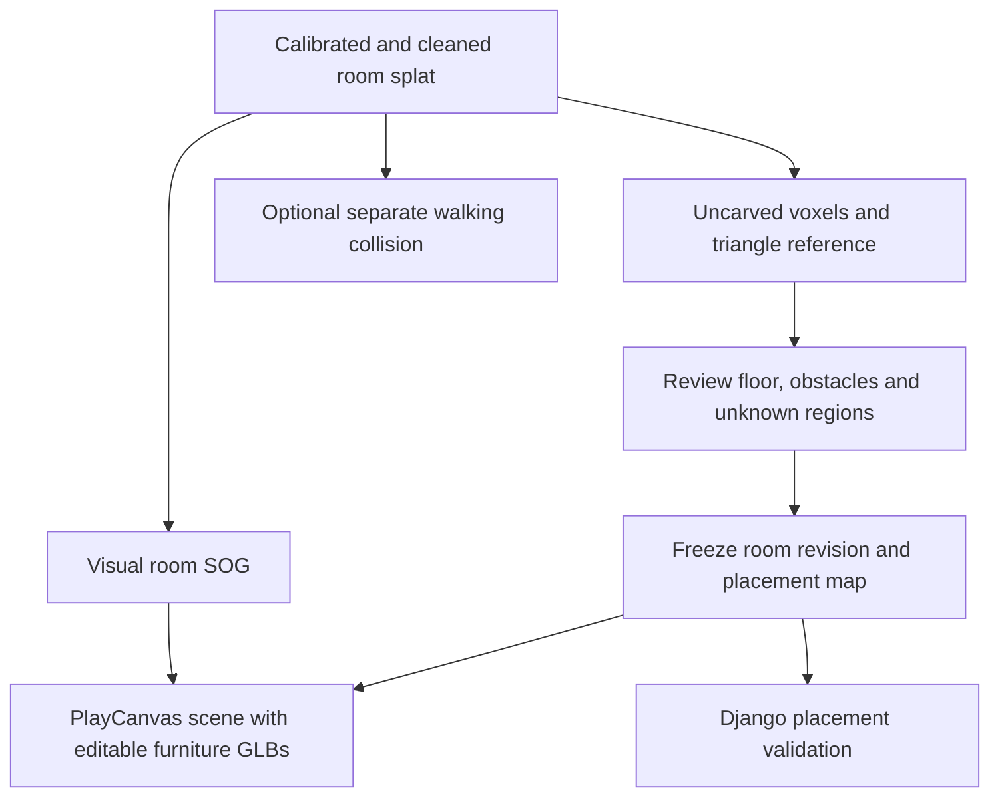

# Generating a fixed surface reference for a splat room

2026-09-19 · Sin · Research and proposed execution; no reconstruction or conversion run yet.

Companion to the [active first-person plan](first-person-playcanvas-plan.md). Keep local laptop processing, fixed scanned objects, separate editable GLBs and the existing centimeter contract.

## Recommendation

Start with one calibrated Gaussian splat and generate a geometry reference locally with **PlayCanvas SplatTransform**. Review the floor, fixed obstacles and usable area before freezing the package. For our own iPhone captures, retain LiDAR depth and camera metadata so we can also build a measured reference or check the generated geometry. Do not require a second reconstruction pipeline before the first mixed-room proof.

The visual room and interaction geometry serve different purposes. We need both, but they can come from the same input:



## Which SuperSplat tool does what?

| Method | Execution | Use for us |
| --- | --- | --- |
| SuperSplat Studio → Assets → Collision → Generate | Server processes the published splat | Automatic walking collision exists, but this route does not satisfy our local-only constraint. |
| SuperSplat Convert | Local browser processing | Quick manual experiment: choose Voxel Collision Bundle, download and inspect its output. |
| SplatTransform CLI | Local process using a supported GPU | Recommended repeatable conversion, with explicit voxel and triangle-mesh options. |
| Same-capture LiDAR mesh or RGB-D fusion | Local capture/preparation workflow | Optional measurement-based reference when we have depth, poses and intrinsics. |

Studio generates a voxel JSON/binary pair. Convert runs in the browser without uploading the splat and exposes voxel resolution and opacity cutoff. These tools process an existing reconstruction; they do not turn an ordinary MP4 into a trained Gaussian room. References: [Studio collision](https://developer.playcanvas.com/user-manual/supersplat/studio/collision/), [Convert](https://developer.playcanvas.com/user-manual/supersplat/convert/).

## Route A: existing splat → local surface reference

1. Obtain a permitted Gaussian PLY/SOG. Review scale against a known measurement, align the floor/up direction, crop unwanted fragments and save the canonical input. Derive all outputs from that saved version.
2. Install and pin a verified release of `@playcanvas/splat-transform` in the preparation tooling when implementation starts. Record its version and GPU adapter. This research has not installed it or qualified the laptop adapter.
3. With `room.ply` already calibrated in meters, run the documented operations below in a preparation directory:

```sh
splat-transform --version
splat-transform --list-gpus
splat-transform room.ply room.sog
splat-transform room.ply surface.voxel.json --voxel-size 0.05 --collision-mesh faces
```

The last command produces `surface.voxel.json`, `surface.voxel.bin` and `surface.collision.glb`. The GLB contains triangle geometry; keep it hidden during normal viewing and expose a wireframe debug toggle. A generic splat export with a `.glb` suffix is not a substitute for requesting a collision mesh.

The CLI uses GPU voxelization; CPU compression support does not imply that voxel generation has a CPU fallback. If the native adapter fails, try local Convert and inspect its supported output instead of switching silently to hosted generation. References: [CLI and GPU options](https://github.com/playcanvas/splat-transform), [output file specification](https://developer.playcanvas.com/user-manual/splat-transform/voxel-format/).

### Surface extraction versus walking geometry

SplatTransform voxelizes Gaussian opacity. `faces` extracts exposed voxel faces; `smooth` uses marching cubes and mesh simplification. Its optional fill and capsule-carving stages change the geometry to produce navigable space. [Collision generation method](https://developer.playcanvas.com/user-manual/splat-transform/collision/)

Our first surface export deliberately omits fill/carve. Keep any walking output separate: a region traversable by a person does not establish that a sofa fits. Also inspect cleanup filters before adopting them; disconnected real obstacles must not disappear from placement checks.

Treat the uncarved result as a draft reference. It may contain surface shells, floaters and holes. A triangle intersection test alone can miss a product placed entirely inside a hollow scanned object. For the MVP, review conservative obstacle footprints/volumes and the supported floor instead of treating the raw shell as complete solid geometry.

## Route B: our iPhone capture → splat and optional measured geometry

Capture once and preserve synchronized RGB, depth, intrinsics and camera poses. Exporting only a normal video loses the data required by this route.

For a supported LiDAR iPhone, Nerfstudio documents Record3D's **EXR + JPG sequence** export and this dataset conversion:

```sh
ns-process-data record3d --data capture --output-dir processed
```

That command prepares a dataset; it does not train a splat or generate collision. Its dependency setup on our laptop remains untested. The tutorial's subsequent `nerfacto` training is a NeRF workflow, so use a Gaussian trainer for our output. [Record3D instructions](https://docs.nerf.studio/quickstart/custom_dataset.html#record3d-capture)

Use **Brush** as the local-training candidate: it supports macOS and Nerfstudio-format datasets. Open the processed dataset in its native application, train, then export the Gaussian model for SuperSplat preparation and Route A. Verify the installed release and a small dataset first; compatibility in documentation is not an end-to-end test of our capture. Preserve any coordinate normalization applied during training. [Brush](https://github.com/ArthurBrussee/brush)

If an appropriate mesh is already available from the same capture, inspect it before building another pipeline. Otherwise, a small adapter can fuse original posed depth frames with Open3D's `ScalableTSDFVolume`, then call `extract_triangle_mesh()`. TSDF combines depth observations; marching cubes extracts their surface. The adapter must handle actual depth units, matching intrinsics, timestamps, confidence and pose conventions. This is additional implementation work, not an automatic consequence of running the Record3D converter. [Open3D RGB-D integration](https://www.open3d.org/docs/release/tutorial/pipelines/rgbd_integration.html)

Compare that measured mesh with the splat-derived reference. Choose the reviewed geometry for each supported region; do not union contradictory surfaces automatically. Missing or poorly aligned regions remain unknown.

## Our integration and review work

The proposed package lives under `shared/rooms/<room-id>/<revision>/`:

| Artifact | Responsibility |
| --- | --- |
| `room.sog` | Captured appearance |
| `surface.voxel.json` / `.bin` | Generated occupancy reference |
| `surface.collision.glb` | Triangle reference for inspection and geometry queries |
| `spatial.json` | Our reviewed floor, blocked obstacles and unknown regions |
| `manifest.json` | Units, transforms, immutable revision, provenance and quality checks |
| Optional separate navigation files | Walking constraints after their own qualification |

Generated solid/empty data does not distinguish observed free space from uncaptured space. Our map must retain that distinction. Floor/wall labels and product-safe clearances also remain application responsibilities.

Check voxel format versions when importing: version 1.1 uses the PlayCanvas engine frame, while 1.0 uses the source PLY frame; the documented conversion includes a 180° Z rotation. Use `gridBounds` for voxel addressing. Implement one explicit adapter and verify an asymmetric landmark so we do not apply an import rotation twice. [Coordinate and version specification](https://developer.playcanvas.com/user-manual/splat-transform/voxel-format/)

The `0.05` recipe means 5 cm only for meter-calibrated input. Our API stays in centimeters and rendering still uses `SCENE_UNIT_CM`; scale all assets, cameras and geometry consistently. Grid resolution does not establish measurement accuracy.

For the first acceptance test, show the splat, triangle wireframe, floor grid and a known-size GLB together. Inspect several room locations, check independent dimensions, and attempt placements against a wall, inside a fixed sofa and in an approved free patch. Verify rejection reasons and unchanged layout on failure. Unknown space cannot return verified success. Freeze only the reviewed region, following the active plan's uncertainty and calibration gate.

Finally test GLB/grid occlusion in front of and behind a fixed obstacle. Conservative collision geometry is not automatically a suitable visual depth proxy; incorrect silhouettes can hide valid pixels. The final renderer and Django must use the same room revision and coordinate contract.

## Status

Primary documentation verified; workflows proposed. No tool installation, room download, training, surface generation, performance benchmark or mixed-scene runtime test has been performed in this research pass. Start with Route A and one qualified asset; add Route B when the capture export is available.
